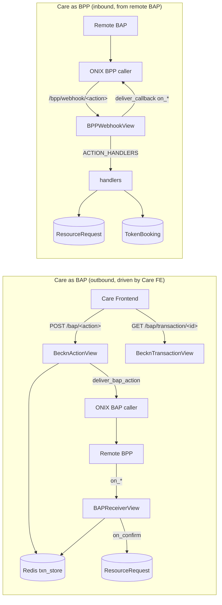

# CARE Beckn NFH Integration

Integration layer that connects CARE to the **Beckn NFH (National Health Stack / DHN)**
network so facilities can send and receive **referrals** and **appointments** across
instances.

It is a pure **integration app** — it defines **no Django models and no migrations**.
All durable state lives on core CARE models (`ResourceRequest`, `TokenBooking`,
`Patient`) via JSON fields, plus Redis for in-flight orchestration.

---

## 1. Core concepts

| Term | Meaning |
|---|---|
| **BAP** | Beckn Application Platform — the *consumer* side. Care acts as BAP when it *initiates* a transaction (Care FE requesting a referral/appointment). |
| **BPP** | Beckn Provider Platform — the *provider* side. Care acts as BPP when it *receives* an action from another party. |
| **ONIX** | The Beckn adapter/gateway. Signs, verifies, and routes messages. Care never talks to the network directly — always through ONIX (`onix-bpp` / `onix-bap` callers). |
| **Async pattern** | Every request returns only an **ACK/NACK** synchronously; the real result arrives later as an **`on_*` callback** (`init` → `on_init`, etc.). |
| **transactionId** | Beckn correlation key, stable across a whole exchange. Used to correlate callbacks. |
| **coordinationId** | Stable referral id (== the origin `ResourceRequest.external_id`). |

Care can play **both roles simultaneously** (even loopback / single-instance for testing).

---

## 2. Two flows, two directions

---

## 3. Directory / file-by-file breakdown

### Top level

| File | Purpose | Key symbols / what it hits |
|---|---|---|
| `apps.py` | Django `AppConfig`. Loads signals on startup. | `BecknConfig.ready()` → imports `signals` |
| `urls.py` | All Beckn routes (BPP webhook, BAP receiver, BAP actions, transaction poll). | `BPPWebhookView`, `BAPReceiverView`, `BecknActionView`, `BecknTransactionView` |
| `constants.py` | Protocol constants: version, JSON-LD contexts, `ACTION_CALLBACK_MAP`, contract statuses, lifecycle states, health-service types, acceptance modes. | `ACTION_CALLBACK_MAP`, `CONTRACT_STATUS_*`, `LIFECYCLE_*` |
| `config.py` | Facility resolution helpers for inbound payloads. | `resolve_origin_facility()`, `resolve_assigned_facility()`, `get_default_geo_organization()` → `care.facility.models.Facility` |
| `mappers.py` | NFH ↔ Care code mapping + payload extraction. | `map_gender()`, `map_status_to_lifecycle()`, `get_contract()`, `get_contract_attributes()`, `get_coordination_id()` |
| `signals.py` | Emits callbacks in response to Care state changes (see §5). | 4 receivers on `TokenBooking` / `ResourceRequest` |
| `tasks.py` | Celery + inline tasks for callback delivery and referral state. | `send_appointment_on_status` (shared_task), `submit_resource_request_referral()`, `complete_referral_for_booking()`, `handle_beckn_reschedule()`, `get_booking_beckn_context()`, `is_beckn_booking()` |

### `api/` — HTTP entry points

| File | View | Role | What it does |
|---|---|---|---|
| `webhook.py` | `BPPWebhookView` | BPP inbound | Dispatch `select/init/confirm/status/cancel/update` to `ACTION_HANDLERS`; ACK sync, fire `on_*` async. Short-circuits stray `on_*` (loopback). |
| `bap_webhook.py` | `BAPReceiverView` | BAP callbacks | Correlate `on_*` to a Redis txn (orchestration) **or** to a `ResourceRequest.external_id` (direct referral); advance state. |
| `bap_actions.py` | `BecknActionView`, `BecknTransactionView` | BAP outbound + poll | FE-driven `discover → select → confirm`; builds payloads (passthrough or adapter), persists Redis state, delivers via `deliver_bap_action`; poll endpoint returns status or a single action slice. |

### `services/` — domain logic

| File | Purpose | Hits |
|---|---|---|
| `handlers.py` | The **BPP action handlers** — `ACTION_HANDLERS` maps action → handler. Referral (`_referral_*`) and appointment (`_appointment_*`) branches. Creates/updates `ResourceRequest` / `TokenBooking`. | `ResourceRequest`, `TokenBooking`, `SchedulableResource`, patient/facility resolution |
| `txn_store.py` | Redis store for in-flight BAP transactions + booking→referral link. | Django cache (Redis) |
| `caller.py` | Async fire-and-forget delivery of `on_*` to ONIX BPP caller. | `requests`, `settings.BECKN_BPP_CALLER_URL` |
| `bap_caller.py` | Sync delivery of outbound actions to ONIX BAP caller. | `requests`, `settings.BECKN_BAP_CALLER_URL` |
| `lookup.py` | Find `ResourceRequest` by contract id → coordinationId → transactionId. | `ResourceRequest` |
| `patient.py` | Patient match/create for inbound referrals (ABHA → phone → demographics). | `Patient`, geo org |
| `identifiers.py` | Health-id (ABHA/HFR/MRN) storage & lookup. | `PatientIdentifier`, `PatientIdentifierConfig` |
| `scheduling.py` | Wrappers over Care scheduling for the appointment flow. | scheduling viewsets, `TokenSlot`, `TokenBooking`, `Availability` |
| `catalog.py` | Build Beckn catalog from facilities/schedules. | `Schedule`, `Availability`, `SchedulableResource` |
| `publisher.py` | Publish catalog to the network (`catalog/publish`). | `requests`, `settings.BECKN_*` |
| `flows/` | Service-type adapters for BAP orchestration. | `base.py` (`FlowAdapter`/`FlowError`), `consultation.py` (referral, creates RR on confirm), `appointment.py`, `__init__.py` (`REGISTRY`, `get_adapter`) |

### `builders/` — payload construction

| File | Builds |
|---|---|
| `context.py` | `on_*` callback context (`build_callback_context`) — keeps txnId, new messageId/timestamp. |
| `catalog.py` | Discover catalog + appointment callbacks (`build_on_discover`, `build_appt_on_*`). |
| `referral.py` | Referral callbacks (`build_on_select/init/confirm/status/cancel`) — inject RR state, lifecycle. |
| `referral_request.py` | Outbound referral confirm (Care as BAP) `build_referral_confirm`, `build_referral_update_callback`. |
| `outbound.py` | Shared outbound context + routing (`build_context`, `extract_routing`, `PROTECTED_CONTEXT_KEYS`). |

### `management/commands/`

- `publish_beckn_catalog.py` — CLI to publish the catalog (`--all`, `--coordination`, `--dry-run`).

### `tests/`

- `test_bap_orchestration.py` — Redis txn store, flow registry, BAP receiver/action orchestration, appointment→referral completion.

---

## 4. Action → handler → callback map

Both maps are keyed by the same action names (`constants.py` / `handlers.py`):

| Inbound action (BPP) | Handler (`handlers.py`) | Callback emitted |
|---|---|---|
| `discover` | `handle_discover` → `_appointment_discover` | `on_discover` |
| `select` | `handle_select` → `_referral_select` / `_appointment_select` | `on_select` |
| `init` | `handle_init` → `_referral_init` / `_appointment_init` | `on_init` |
| `confirm` | `handle_confirm` → `_referral_confirm` / `_appointment_confirm` | `on_confirm` |
| `status` | `handle_status` | `on_status` |
| `update` | `handle_update` → `_appointment_update` | `on_update` |
| `cancel` | `handle_cancel` | `on_cancel` |

Outbound BAP actions (`bap_actions.py`): `discover, select, init, confirm, status, cancel, update`.
`discover` starts a new Redis transaction; the rest operate on an existing `transactionId`.
Flow adapters (`REGISTRY`): `consultation` (alias `coordination`) and `appointment`.

---

## 5. Signal triggers (`signals.py`)

| Signal | Model | Receiver | Fires when → does |
|---|---|---|---|
| `pre_save` | `TokenBooking` | `capture_previous_booking_status` | Stashes prior status for change detection. |
| `post_save` | `TokenBooking` | `notify_beckn_on_status_change` | On transition into `booked/cancelled/entered_in_error/rescheduled/fulfilled` for a **Beckn** booking → `send_appointment_on_status.delay()`; also queues reschedule pairing. |
| `post_save` | `TokenBooking` | `complete_referral_on_booking_fulfilled` | On `fulfilled` → `complete_referral_for_booking()` (uses `meta['beckn']['coordinationRef']`). |
| `post_save` | `ResourceRequest` | `initiate_beckn_referral_on_create` | On create of a `pending` RR in `{other, patient_care, medicines}` **not** already inbound → `submit_resource_request_referral()` after commit. |

Notes:

- Reschedule is handled entirely in the signal + `handle_beckn_reschedule` (no core scheduling changes).
- `suppress_beckn_notifications()` context manager mutes callbacks during BAP-initiated updates.

---

## 6. Where state is stored

- **`ResourceRequest.extensions["beckn"]`** — `role`, `coordinationId`, `transactionId`,
  `contract`, `contractAttributes`, `participants`, `consent`,
  `returnRouting{bapId,bapUri}`, `target{bppId,bppUri}`, `originResourceRequestId`.
- **`TokenBooking.meta["beckn"]`** — `transactionId`, `context`, `message`,
  `coordinationRef`, `bapId`, `bapUri`, `contract`.
- **`Schedule.meta["beckn"]`** — `healthServiceType`, `acceptanceMode`, `bppId`, `bppUri`.
- **Redis** — `beckn:txn:<id>` (orchestration), `beckn:booking-referral:<id>`
  (booking→referral, 90-day TTL).

---

## 7. URLs

Mounted under `/api/v1/beckn/` (`config/urls.py`):

- `bpp/webhook[/<action>]` → `BPPWebhookView`
- `bap/receiver[/<action>]` → `BAPReceiverView`
- `bap/transaction/<transaction_id>` → `BecknTransactionView` (poll)
- `bap/<action>` → `BecknActionView`
- Root-level receiver aliases in `config/urls.py` for ONIX adapters that post prefix-less paths.

---

## 8. Settings (env)

`BECKN_BPP_ID/URI/CALLER_URL`, `BECKN_BAP_ID/URI/CALLER_URL`,
`BECKN_CC_BPP_ID/URI`, `BECKN_NETWORK_ID`, `BECKN_VERSION` (default `2.0.0`),
`BECKN_SYSTEM_USERNAME`, `BECKN_COORDINATOR_*`.
All defined in `config/settings/base.py`.

---

## 9. End-to-end workflows

**Inbound referral (Care as BPP):** remote `init` → `_referral_init` creates a `pending`
RR, `on_init` publishes `contract.id = RR.external_id` → remote `confirm` →
`_referral_confirm` approves/creates per-facility RR(s) → `on_confirm`. Later
`status`/`update` correlate by contract/coordination id.

**Outbound referral (Care as BAP):** RR created in Care → signal →
`submit_resource_request_referral` sends `confirm` (transactionId = `external_id`) → CC
`on_confirm` (ACTIVE → approved), later `on_update`/`on_status` (COMPLETED → completed)
via `BAPReceiverView._handle_referral_callback`.

**Appointment (BAP orchestration):** FE `discover → select → confirm` through
`BecknActionView` + Redis; `on_confirm` → adapter `on_confirmed()`. Booking status
changes emit unsolicited `on_status` via signals.

**Reschedule:** original booking marked `rescheduled` (emits CANCELLED on_status);
replacement inherits context (`handle_beckn_reschedule`) and emits ACTIVE on_status with
the new contract id, same transactionId.

---

## 10. Refactor / complexity hotspots

1. **Raw JSON access is scattered** — `extensions["beckn"]` / `meta["beckn"]` poked in
   ~8 files with magic-string keys (also as ORM paths like
   `extensions__beckn__coordinationId`). Centralize behind a typed accessor (`state.py`) —
   single source of truth for keys, reads, writes, and queries.
2. **`handlers.py` is large and mixed** — referral and appointment branches in one file;
   consider splitting `handlers/referral.py` + `handlers/appointment.py` behind the
   `ACTION_HANDLERS` map.
3. **Two delivery mechanisms** — `caller.py` (threaded fire-and-forget) vs `bap_caller.py`
   (sync). Unify on a Celery task for reliability; keep a sync fallback.
4. **Dual RR creation on confirm** (origin + assigned) — idempotent by
   `coordinationId + role`; document/guard the loopback double-create.
5. **Settings coupling** — `settings.BECKN_*` read directly; wrap in one config accessor to
   ease the eventual plugin extraction.
6. **No models = no migrations** — safe to move; the only "schema" is the JSON blob shapes
   in §6, so lock those down with the accessor before refactoring.
