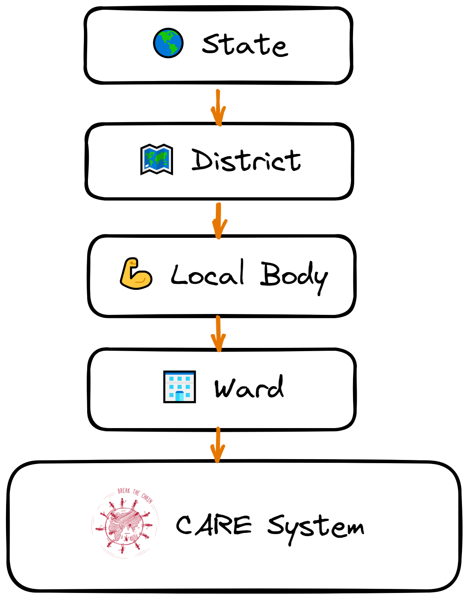
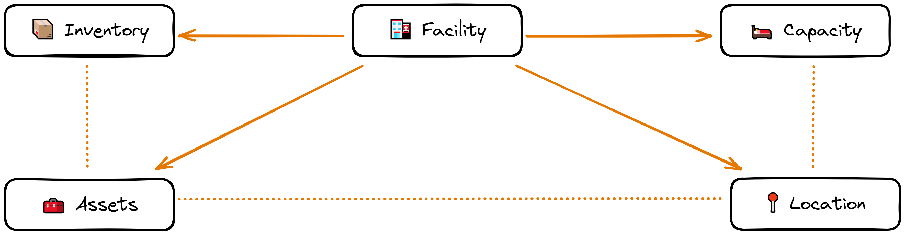
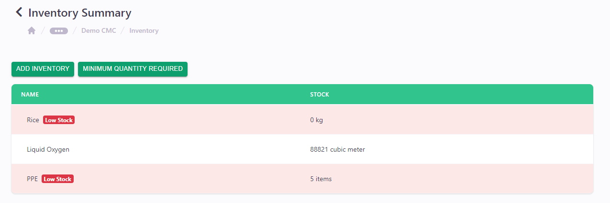
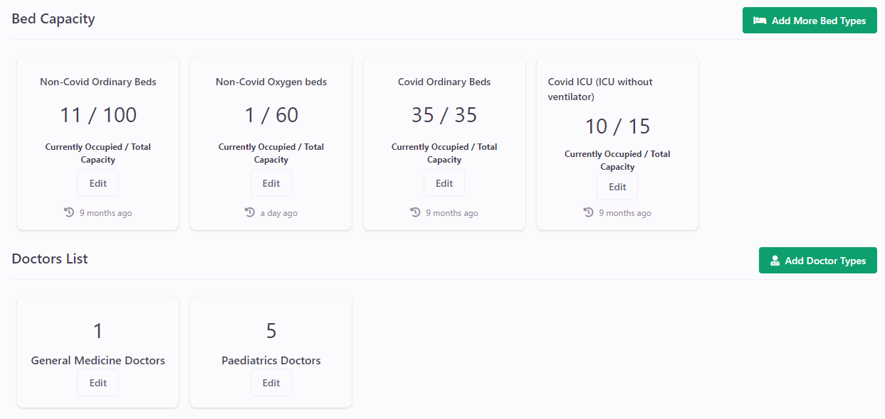
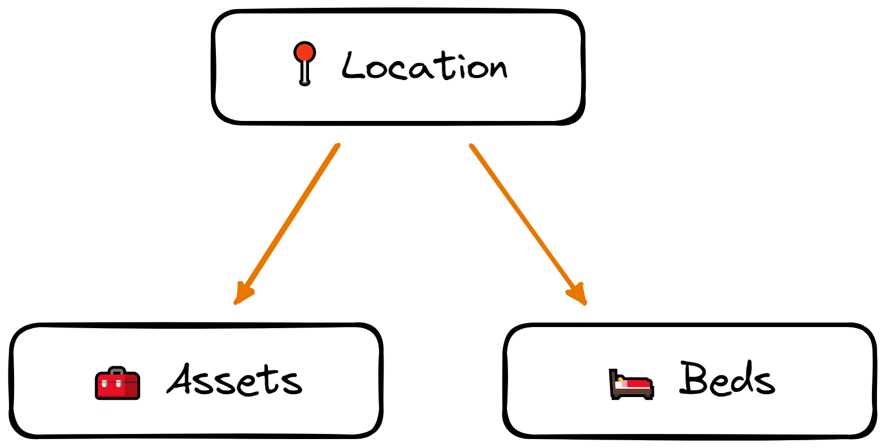
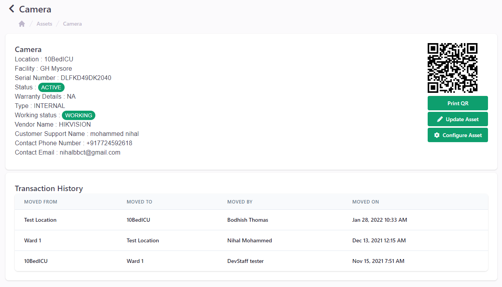
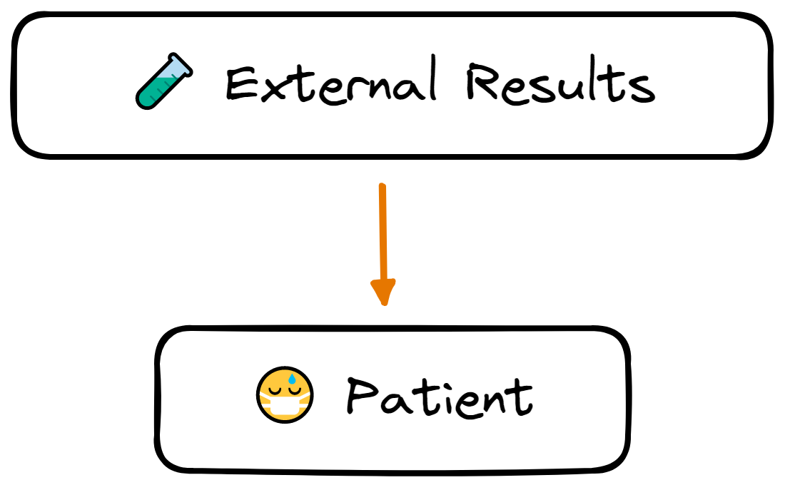

===============
Glossary
===============

**CARE** is a comprehensive capacity and patient management tool, built specifically for the COVID Pandemic Management. It is a web-based application hosted at  https://care.ohcnetwork.network/

This document gives an overview of the Care System for the developers who are willing to contribute to it.

Hierarchy
************

Care Systems maintain and process data up to **Ward** Level right from State. This means the each record of a model will be associated up to Ward Level.

Models
************

Facility
-----------

- Facilities represent **Hospitals** associated with the Ward.
- There are 15+ Facility **Types** in the Care System with its `ID Number Conventions <https://github.com/ohcnetwork/care/blob/6b39d0c8c2cd65c5f86db3fc667456f2d28db70c/care/facility/models/facility.py#L44>`_
- Each Facility record has its Basic information, Bed Capacity, Oxygen Cylinder Capacity and Doctor Capacity.
- Reference: Karunya Arogya Suraksha Padhathi `(KASP) <https://sha.kerala.gov.in/karunya-arogya-suraksha-padhathi/>`_ - Health Care Scheme

Inventory
--------------

- Inventory refers to all the items, goods, merchandise, and materials held by a Facility.
- Inventory Management helps us keep track of stocks of the items.
- Examples of Inventories could be PPE Kits, Rice, Masks etc.
- We can also set minimum quantities to each inventories. We will be notified when we run out of stock.

Capacity
--------------

- Each facility can hold the details of **Bed Capacity and Doctor Count.**
- Bed Capacity details would include Type of Beds, Occupied Beds and Total Beds.
- Doctor Count details would include Type of Doctor and their count.

Location
--------------

- Facilities can have multiple locations. These locations has name and description which gives flexibility to customize according to Facility’s need.
- Bed Details can be added to each locations if need.
- *Examples*: Different Departments and Wards

Assets
------------

- Assets refers to things such as instrument, equipment and other properties.
- Assets are different from Inventory. Inventories are based on the stocks and quantities.
- Assets are **linked with a specific location** of a Facility.
- Assets can be moved from one location to another location within a Facility.

External Results
--------------------

- External Results hold the data of test results that comes from External Sources.
- Examples would include RT-PCR / ANTIGEN test from a private lab.
- These Result can be used to create Patient if they are found to be COVID suspect.

Patient
--------

- Patients should be created under a Facility.
- Patients can be created manually or directly by pulling the data from a External Result.
- Patient has three main sections namely **Personal Details**, **Health Details** and **Medical History.**
- Each patient in the system is uniquely identifiable by the Phone Number and Date of Birth.

Resources
---------

- Overall Concept Diagram - :download:`Download <contents/CareConceptDiagram.png>`
- Excalidraw Diagram file - :download:`Download <contents/CareConceptDiagram.excalidraw>`
