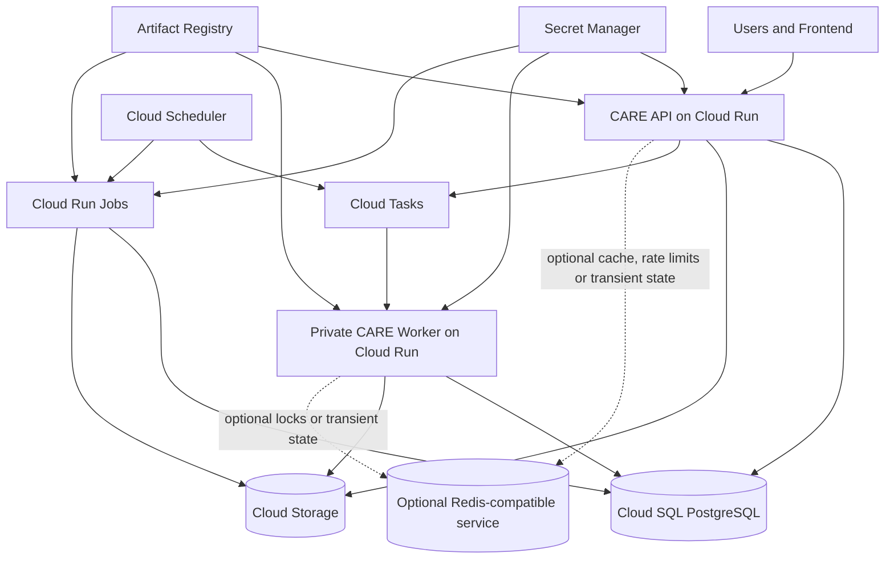

# CARE GCP Deployment and Compatibility Guide

## 1. Purpose

This guide defines how to deploy and operate CARE on Google Cloud Platform while preserving compatibility with the official upstream repository.

The objective is not to redesign CARE.

The objective is to adapt its infrastructure so that it can run with low operational overhead, avoid permanently running virtual machines where practical, and continue receiving future upstream updates with minimal conflict.

This guide is intentionally limited to deployment, infrastructure integration and the smallest application changes required to support that deployment model.

---

## 2. Primary Goal

The primary goal is to run CARE using managed or serverless Google Cloud services.

The target production architecture is:

- CARE backend on Cloud Run
- PostgreSQL on Cloud SQL
- clinical and facility files on Cloud Storage
- asynchronous tasks on Cloud Tasks
- asynchronous task execution on a private Cloud Run worker
- periodic tasks on Cloud Scheduler
- batch and maintenance operations on Cloud Run Jobs
- container images on Artifact Registry
- secrets on Secret Manager
- logs on Cloud Logging

The architecture SHOULD avoid:

- permanently running Compute Engine virtual machines
- self-managed PostgreSQL
- self-managed MinIO
- self-managed Redis
- permanently running Celery workers

---

## 3. Core Constraint

The fork MUST remain maintainable against:

```text
https://github.com/ohcnetwork/care
````

The official `develop` branch is treated as upstream.

Changes introduced by this project MUST minimize divergence from upstream.

Whenever possible, the implementation SHOULD add new files instead of heavily modifying existing upstream files.

---

## 4. What This Project Is

This project is an infrastructure adaptation of CARE.

It adds support for:

* Google Cloud deployment
* Google Cloud Storage
* Cloud Tasks
* Cloud Run
* Cloud SQL
* Cloud Scheduler
* Cloud Run Jobs
* optional Redis-compatible services
* Terraform or equivalent infrastructure as code
* deployment automation
* upstream synchronization procedures

It MAY add small internal adapters where CARE currently depends directly on infrastructure that must be replaced in GCP.

---

## 5. What This Project Is Not

This project is not:

* a rewrite of CARE
* a redesign of the clinical domain
* a replacement for Django
* a replacement for Django ORM
* a migration away from PostgreSQL
* a full Clean Architecture conversion
* a Domain-Driven Design restructuring
* a repository-pattern migration
* a provider-neutral framework for every possible cloud
* a general-purpose infrastructure abstraction library

The project MUST NOT introduce abstractions unrelated to the deployment objective.

---

## 6. Django and Django ORM

Django is an accepted and intentional part of the architecture.

Django ORM remains the standard persistence mechanism.

Existing code MAY continue to use:

```python
Patient.objects.get(...)
Encounter.objects.filter(...)
Facility.objects.select_related(...)
```

The project MUST NOT introduce repositories for domain models solely to isolate Django ORM.

Custom managers, querysets or service functions MAY be added when justified by:

* query reuse
* readability
* performance
* transactional behavior
* existing CARE conventions

They MUST NOT be added merely for architectural purity.

---

## 7. Upstream Code Ownership

Existing CARE applications remain owned conceptually by upstream.

Examples include:

```text
care/emr/
care/facility/
care/users/
care/security/
config/
docker/
scripts/
```

These files MAY be modified when necessary, but changes SHOULD be:

* small
* focused
* backwards compatible
* covered by tests
* easy to reapply after upstream changes

Large file moves and package reorganizations are prohibited unless upstream itself performs them.

---

## 8. Deployment Models

The project supports at least two deployment models.

### 8.1 Local or traditional deployment

The existing upstream-compatible stack remains available:

* Docker Compose
* PostgreSQL
* Redis
* Celery
* MinIO

This environment is used for:

* local development
* upstream compatibility tests
* contributor onboarding
* deployments that prefer traditional infrastructure

### 8.2 GCP deployment

The GCP deployment uses:

* Cloud Run
* Cloud SQL
* Cloud Storage
* Cloud Tasks
* Cloud Scheduler
* Cloud Run Jobs
* Secret Manager
* Artifact Registry

Redis MAY be enabled as an optional service for selected responsibilities.

---

## 9. Target Architecture



---

## 10. Service Replacement Map

The initial replacement strategy is:

| Existing local component | GCP production component                         |
| ------------------------ | ------------------------------------------------ |
| Django backend container | Cloud Run service                                |
| PostgreSQL container     | Cloud SQL for PostgreSQL                         |
| MinIO                    | Cloud Storage                                    |
| Redis as Celery broker   | Cloud Tasks                                      |
| Celery worker            | Private Cloud Run worker                         |
| Celery Beat              | Cloud Scheduler                                  |
| maintenance commands     | Cloud Run Jobs                                   |
| local secrets or `.env`  | Secret Manager and runtime environment variables |
| locally built images     | Artifact Registry                                |

Redis is not replaced globally.

Only its use as the Celery broker is replaced by Cloud Tasks in the default GCP deployment.

---

## 11. Redis Policy

Redis becomes optional in GCP.

Redis MUST NOT remain a mandatory dependency merely because several unrelated CARE features currently use it.

Its responsibilities MUST be evaluated separately.

Potential responsibilities include:

* Celery broker
* Celery result backend
* Django cache
* distributed locks
* rate limiting
* temporary state
* sessions
* direct Redis operations

The default GCP strategy is:

| Responsibility            | Default GCP backend                   | Optional alternative     |
| ------------------------- | ------------------------------------- | ------------------------ |
| task broker               | Cloud Tasks                           | Celery with Redis        |
| task result state         | PostgreSQL or domain records          | Redis                    |
| non-critical cache        | LocMem                                | Redis-compatible service |
| distributed locks         | PostgreSQL advisory locks             | Redis-compatible service |
| application rate limiting | PostgreSQL or existing CARE mechanism | Redis-compatible service |
| temporary shared state    | PostgreSQL                            | Redis-compatible service |
| sessions                  | existing Django configuration         | Redis                    |

---

## 12. Redis-Compatible Providers

When Redis is enabled, the implementation SHOULD use standard Redis protocols and avoid depending on one vendor.

Potential providers include:

* Upstash Redis
* Google Memorystore
* Redis OSS
* Valkey
* Dragonfly
* KeyDB

The application SHOULD use provider-neutral configuration such as:

```env
CARE_CACHE_BACKEND=redis
REDIS_CACHE_URL=rediss://...
```

It SHOULD NOT use provider-specific names such as:

```env
USE_UPSTASH=true
```

unless functionality is genuinely unique to that provider.

---

## 13. Upstash

Upstash MAY be used for responsibilities compatible with its service model.

Reasonable uses include:

* shared cache
* rate limiting counters
* non-critical transient state
* short-lived coordination

Upstash SHOULD NOT automatically become:

* the Cloud Tasks replacement
* a reason to retain permanently running Celery workers
* the primary durable store
* the only integrity mechanism for clinical operations

Sensitive data stored in any external Redis-compatible service MUST be minimized.

Keys and values SHOULD use opaque identifiers rather than patient names, diagnoses, clinical notes or complete task payloads.

Any production use MUST be reviewed against applicable privacy, contractual and data-residency requirements.

---

## 14. MinIO and Cloud Storage

MinIO remains supported for local development.

Production GCP SHOULD use Cloud Storage.

Django `FileField` and `default_storage` SHOULD continue using standard Django storage APIs whenever possible.

A custom storage adapter SHOULD only be introduced for operations that are not adequately covered by Django storage, such as:

* provider-specific signed upload flows
* multipart upload coordination
* direct bucket operations
* direct `boto3` usage
* nonstandard object metadata operations

The project MUST NOT create an elaborate storage abstraction if changing Django `STORAGES` is sufficient.

---

## 15. Celery and Cloud Tasks

Celery remains supported.

The local stack MAY continue to use:

```text
Redis + Celery worker + Celery Beat
```

The default GCP stack SHOULD use:

```text
Cloud Tasks + private Cloud Run worker + Cloud Scheduler
```

A small task-dispatch adapter MAY be introduced to choose between:

```env
CARE_TASK_BACKEND=celery
```

and:

```env
CARE_TASK_BACKEND=cloud_tasks
```

The adapter MUST remain limited to task dispatch and task execution concerns.

It MUST NOT become a general application framework.

---

## 16. Cloud Run Services

The production deployment SHOULD use separate Cloud Run services for:

### CARE API

Receives user and frontend requests.

### CARE task worker

Receives authenticated task requests from Cloud Tasks.

The worker SHOULD:

* deny unauthenticated access
* accept only explicitly registered task handlers
* use OIDC-based invocation
* scale to zero
* return non-2xx responses for retriable failures

Both services SHOULD use the same container image when practical.

---

## 17. Cloud Run Jobs

Cloud Run Jobs SHOULD execute operations that do not belong in request-serving services.

Examples include:

* database migrations
* fixture loading
* value-set synchronization
* bulk cleanup
* data imports
* scheduled batch processing
* administrative Django commands

Database migrations MUST NOT run automatically every time a Cloud Run API instance starts.

---

## 18. Cloud SQL

Cloud SQL remains a continuously provisioned service and generally does not scale to zero.

This is accepted because PostgreSQL is CARE's durable system of record.

The deployment SHOULD minimize its cost without compromising:

* data durability
* backups
* security
* acceptable performance
* recovery requirements

Development environments MAY use smaller instances and simplified availability settings.

Production environments MUST define:

* automated backups
* point-in-time recovery when required
* deletion protection where appropriate
* private or controlled connectivity
* connection limits
* recovery procedures

---

## 19. Cost Objective

The architecture SHOULD minimize idle compute cost.

Services expected to scale to zero include:

* CARE API on Cloud Run, when traffic permits
* CARE worker on Cloud Run
* Cloud Run Jobs
* Cloud Tasks consumers

Services that may produce persistent cost include:

* Cloud SQL
* stored Cloud Storage data
* log retention
* optional Redis services
* network egress
* backups

The guide MUST clearly distinguish between:

* resources that scale to zero
* resources billed per use
* resources with permanent baseline cost

---

## 20. Minimal-Change Principle

Every application modification MUST be justified by a deployment requirement.

Valid reasons include:

* replacing MinIO with GCS
* replacing Redis/Celery task dispatch with Cloud Tasks
* making Redis optional
* supporting private task execution
* making health checks compatible with optional services
* supporting Cloud Run startup and proxy behavior

Invalid reasons include:

* imposing a new domain architecture
* replacing Django ORM
* moving models into new layers
* renaming existing CARE applications
* introducing abstractions with no current deployment use
* preparing speculative support for unrelated technologies

---

## 21. Abstraction Threshold

An abstraction SHOULD be introduced only when at least one of these conditions is true:

1. Two implementations must coexist.

   Example:

   ```text
   Celery and Cloud Tasks
   ```

2. Provider-specific code currently leaks into multiple application modules.

3. A direct dependency prevents the desired GCP deployment.

4. Contract tests can meaningfully verify equivalent behavior.

5. The abstraction reduces upstream modifications.

An abstraction SHOULD NOT be introduced solely because it appears architecturally elegant.

---

## 22. Branch Strategy

The recommended branch model is:

```text
upstream/develop
      |
      v
origin/develop
      |
      v
origin/gcp
      |
      v
feature/*
```

### `origin/develop`

MUST remain an upstream mirror.

It SHOULD contain no project-specific commits.

### `origin/gcp`

Contains the maintained GCP integration.

It SHOULD remain deployable.

### `feature/*`

Contains individual implementation changes.

### `sync/upstream-YYYY-MM-DD`

Used to test and resolve upstream merges before merging into `gcp`.

---

## 23. Upstream Synchronization

The standard synchronization process is:

```bash
git fetch upstream

git switch develop
git reset --hard upstream/develop
git push --force-with-lease origin develop

git switch gcp
git switch -c sync/upstream-YYYY-MM-DD
git merge develop
```

After resolving conflicts:

```bash
make build
make up
make test
```

The GCP-specific tests MUST also run before merging the synchronization branch into `gcp`.

---

## 24. Local Compatibility Requirement

The existing local workflow MUST continue to work.

At minimum:

```bash
make build
make up
make load-fixtures
make test
```

or the current upstream equivalents.

GCP-specific changes MUST NOT require cloud credentials for ordinary local development.

---

## 25. Security Scope

CARE handles sensitive healthcare information.

The GCP deployment MUST follow these minimum rules:

* Cloud Storage buckets MUST NOT be public.
* Cloud SQL MUST NOT use unrestricted public access.
* Cloud Run worker MUST NOT allow unauthenticated invocation.
* Service accounts MUST use least privilege.
* Secrets MUST NOT be committed to Git.
* Static service-account key files SHOULD NOT be used in Cloud Run.
* Application logs MUST NOT contain complete clinical payloads.
* Task payloads SHOULD contain identifiers rather than full clinical records.
* External Redis-compatible services MUST NOT receive unnecessary clinical information.
* Signed URLs MUST use short, documented expiration periods.
* Production access MUST be auditable.

---

## 26. Observability Scope

The initial implementation SHOULD use native stdout and stderr logging compatible with Cloud Logging.

It SHOULD include:

* structured request logs
* task execution logs
* task identifiers
* duration
* failure reason
* retry information
* deployment revision
* environment name

It MUST avoid logging:

* passwords
* access tokens
* signed URLs
* complete patient records
* clinical files
* secret values

Advanced tracing and metrics MAY be added later.

They are not required for the first deployment.

---

## 27. Infrastructure as Code

GCP resources SHOULD be managed using Terraform.

The Terraform configuration SHOULD include:

* required APIs
* Artifact Registry
* Cloud Run API service
* Cloud Run worker service
* Cloud Run Jobs
* Cloud Tasks queues
* Cloud Scheduler jobs
* Cloud Storage buckets
* Cloud SQL
* Secret Manager
* service accounts
* IAM bindings
* basic monitoring
* environment-specific variables

Infrastructure code MUST remain separate from CARE business logic.

---

## 28. Environment Separation

The deployment SHOULD support:

```text
dev
staging
prod
```

Each environment SHOULD have separate:

* Cloud Run services
* Cloud SQL database or instance
* Cloud Storage buckets
* Cloud Tasks queues
* secrets
* service accounts when appropriate

Production clinical data MUST NOT be copied into development environments without an approved anonymization process.

---

## 29. Testing Goals

The project MUST test both deployment modes.

### Local compatibility tests

Verify:

* Docker Compose starts
* Redis and Celery work
* MinIO works
* existing upstream tests pass

### GCP configuration tests

Verify:

* GCP settings load without mandatory Redis
* Cloud Storage configuration is valid
* task backend selection works
* private worker endpoints reject invalid requests
* optional Redis settings validate correctly
* Cloud Run startup commands work
* migrations run as a job

### Contract tests

Contract tests SHOULD be limited to real interchangeable components:

* Celery versus Cloud Tasks dispatch
* MinIO/S3 versus GCS operations where custom adapters exist
* PostgreSQL versus Redis locks if both are implemented

---

## 30. Initial Implementation Order

The implementation SHOULD proceed in this order:

1. Inspect the current CARE repository.
2. Document current infrastructure dependencies.
3. Add isolated GCP settings.
4. Deploy the CARE API on Cloud Run with Cloud SQL.
5. Move production media storage to Cloud Storage.
6. Inventory all Celery tasks and direct Redis usage.
7. Add a minimal task-dispatch abstraction.
8. Add the Celery adapter.
9. Add the Cloud Tasks adapter.
10. Add a private Cloud Run worker endpoint.
11. Migrate one low-risk task as a pilot.
12. Migrate remaining compatible tasks.
13. Move periodic tasks to Cloud Scheduler.
14. Move maintenance and batch commands to Cloud Run Jobs.
15. Classify remaining Redis uses.
16. Make Redis optional in GCP settings.
17. Add optional Redis-compatible configuration, including Upstash compatibility.
18. Add Terraform.
19. Add deployment automation.
20. Document upstream synchronization and rollback.

---

## 31. Definition of Done

The initial GCP adaptation is complete when:

* CARE runs on Cloud Run.
* Cloud SQL stores application data.
* Cloud Storage stores production files.
* Cloud Tasks handles asynchronous production tasks.
* The Cloud Run worker scales to zero.
* Cloud Scheduler replaces Celery Beat in GCP.
* Cloud Run Jobs handle migrations and batch operations.
* Redis is not required for the default GCP deployment.
* Redis remains supported as an optional backend.
* Upstash or another Redis-compatible service can be configured where appropriate.
* Docker Compose remains functional.
* Celery, Redis and MinIO remain functional locally.
* no Compute Engine VM is required.
* upstream synchronization is documented and tested.
* GCP-specific changes remain small and reviewable.

---

## 32. Out of Scope for the Initial Version

The following are explicitly outside the initial scope:

* replacing Django ORM
* introducing repositories for domain models
* moving existing CARE applications
* replacing Django REST Framework
* replacing authentication architecture
* introducing Kubernetes
* supporting every cloud provider
* introducing Temporal
* replacing all existing caches
* redesigning CARE's clinical workflows
* implementing a generic plugin framework
* rewriting all Celery tasks before a pilot succeeds
* creating abstractions for hypothetical future requirements

---

## 33. Governing Rule

When deciding whether to add a new architectural element, ask:

> Is this necessary to deploy CARE cheaply and safely on GCP while keeping upstream updates manageable?

If the answer is no, it does not belong in the initial project.

---

## 34. Next Document

The next document is:

```text
docs/xii/gcp/01-current-runtime.md
```

It will document the current CARE runtime as it actually exists, including:

* Docker Compose services
* Django settings
* PostgreSQL
* Redis responsibilities
* Celery configuration
* Celery Beat
* MinIO and S3-compatible storage
* startup scripts
* health checks
* deployment assumptions
* points that must change for Cloud Run
