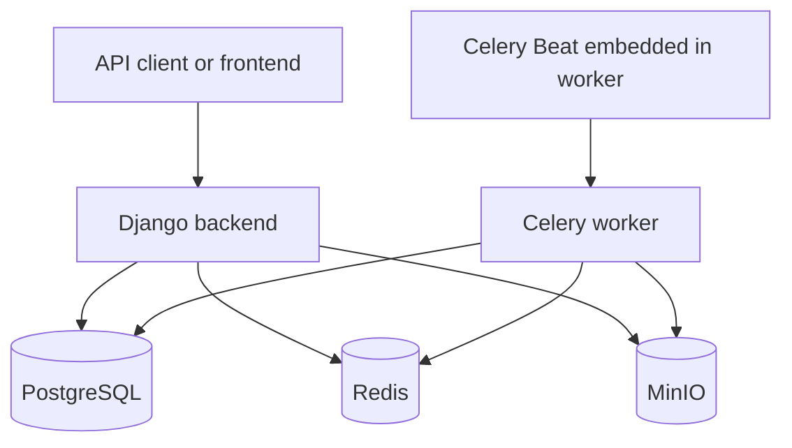

# Current CARE Runtime

## 1. Purpose

This document describes the current runtime architecture of CARE as implemented
in the official `ohcnetwork/care` repository on the `develop` branch.

It is a descriptive inventory of the existing system.

It does not define the target GCP architecture.

It does not prescribe replacements or migration steps.

Architectural decisions and migration requirements are documented separately.

---

## 2. Repository Baseline

The reviewed repository is:

```text
https://github.com/ohcnetwork/care
```

The default development branch is:

```text
develop
```

The repository contains the CARE backend.

The application is based on:

* Django;
* Django REST Framework;
* PostgreSQL;
* Celery;
* Redis;
* S3-compatible object storage;
* Docker Compose;
* environment-based configuration;
* separate settings modules for local, deployment, staging, production and
  testing.

---

## 3. Current Runtime Topology

The local Docker Compose environment consists of five principal services:

```text
backend
celery
db
redis
minio
```

These services are defined across:

```text
docker-compose.yaml
docker-compose.local.yaml
```

The resulting runtime topology is:



The application backend and Celery worker use the same locally built image.

PostgreSQL, Redis and MinIO are separate infrastructure containers.

---

## 4. Docker Compose Files

### 4.1 `docker-compose.yaml`

The base Compose file defines:

* the shared Docker network;
* PostgreSQL;
* Redis;
* MinIO;
* persistent volumes.

The default Docker network is explicitly named:

```text
care
```

### 4.2 `docker-compose.local.yaml`

The local override defines:

* the Django backend;
* the Celery worker;
* the development image build;
* source-code mounts;
* local environment files;
* development startup scripts.

The two Compose files are intended to be used together.

The repository Makefile combines them when executing local development
commands.

---

## 5. PostgreSQL Service

The database container uses:

```text
postgres:17-alpine
```

Its environment is loaded from:

```text
docker/.prebuilt.env
```

The default local database configuration includes:

```text
POSTGRES_USER=postgres
POSTGRES_PASSWORD=postgres
POSTGRES_HOST=db
POSTGRES_DB=care
POSTGRES_PORT=5432
```

The Django database URL is:

```text
postgres://postgres:postgres@db:5432/care
```

### 5.1 Persistence

PostgreSQL data is stored in the named volume:

```text
postgres-data
```

A backup directory is mounted into:

```text
/backups
```

The host-side path defaults to:

```text
./care-backups
```

and can be changed through:

```text
BACKUP_DIR
```

### 5.2 Port exposure

The container database port is mapped as:

```text
host 5433 -> container 5432
```

### 5.3 Health check

The PostgreSQL health check executes:

```bash
pg_isready -U "${POSTGRES_USER:-postgres}"
```

### 5.4 Restart policy

The service uses:

```yaml
restart: unless-stopped
```

---

## 6. Redis Service

The Redis container uses:

```text
redis:8-alpine
```

### 6.1 Persistence

Redis data is stored in:

```text
redis-data
```

### 6.2 Port exposure

Redis is mapped as:

```text
host 6380 -> container 6379
```

### 6.3 Health check

The health check executes:

```bash
redis-cli ping
```

### 6.4 Restart policy

The service uses:

```yaml
restart: unless-stopped
```

---

## 7. MinIO Service

The object-storage container uses:

```text
minio/minio:latest
```

MinIO provides an S3-compatible API for the current local file-storage
implementation.

### 7.1 Credentials

The root credentials use:

```text
MINIO_ACCESS_KEY
MINIO_SECRET_KEY
```

with local defaults:

```text
minioadmin
minioadmin
```

### 7.2 Region compatibility

The container sets:

```text
AWS_DEFAULT_REGION=ap-south-1
```

The repository comments indicate that this value is used to preserve
compatibility with existing application behavior.

### 7.3 Storage persistence

MinIO data is stored in:

```text
./care/media/minio:/data
```

### 7.4 Initialization scripts

The service mounts:

```text
docker/minio/init-script.sh
docker/minio/entrypoint.sh
```

The custom entrypoint is:

```text
/entrypoint.sh
```

### 7.5 Port exposure

MinIO exposes:

```text
host 9100 -> container 9000
```

for the S3-compatible API, and:

```text
host 9001 -> container 9001
```

for the web console.

### 7.6 Health check

The health check requests:

```text
http://localhost:9000/minio/health/ready
```

---

## 8. Application Image

The local application image is named:

```text
care_local
```

It is built from:

```text
docker/dev.Dockerfile
```

The build context is the repository root.

The build supports:

```text
ADDITIONAL_PLUGS
```

as a build argument.

The image is not intended to be pulled from Docker Hub or another public
registry.

Both the backend and Celery services reuse this image.

---

## 9. Django Backend Service

The backend service:

* uses the `care_local` image;
* builds the image when required;
* loads `docker/.local.env`;
* mounts the repository into `/app`;
* runs `scripts/start-dev.sh`;
* exposes the Django development server;
* exposes debugpy;
* restarts unless stopped.

### 9.1 Source mount

The project root is mounted as:

```text
.:/app
```

This enables live source-code changes during development.

### 9.2 Ports

The backend exposes:

```text
9000
```

for Django and:

```text
9876
```

for debugpy.

### 9.3 Dependencies

The backend declares dependencies on:

```text
db
redis
celery
```

The Celery dependency uses a health condition.

---

## 10. Backend Startup Script

The development backend starts through:

```text
scripts/start-dev.sh
```

The script performs the following sequence:

1. Writes the role `api` to `/tmp/container-role`.
2. Waits for PostgreSQL.
3. Waits for Redis.
4. Runs `collectstatic`.
5. Compiles translation messages.
6. Starts Django.

The normal server command is:

```bash
python manage.py runserver_plus \
    0.0.0.0:9000 \
    --print-sql
```

When debugger attachment is enabled, the process is started through:

```text
debugpy
```

The backend startup currently assumes that both PostgreSQL and Redis are
available before Django starts.

---

## 11. Celery Service

The Celery service:

* uses `care_local`;
* loads `docker/.local.env`;
* mounts the project into `/app`;
* runs `scripts/celery-dev.sh`;
* depends on PostgreSQL and Redis;
* restarts unless stopped.

---

## 12. Celery Startup Script

The worker starts through:

```text
scripts/celery-dev.sh
```

The script performs:

1. Writes the role `celery` to `/tmp/container-role`.
2. Waits for PostgreSQL.
3. Waits for Redis.
4. Runs database migrations.
5. Compiles translations.
6. Runs `sync_permissions_roles`.
7. Runs `sync_valueset`.
8. Starts Celery through `watchmedo`.

The Celery command is:

```bash
celery \
    --workdir="$(pwd)" \
    -A config.celery_app \
    worker \
    -B \
    --loglevel=INFO
```

The `-B` option embeds Celery Beat in the worker.

The development Celery container therefore performs:

* initialization and synchronization;
* schema migration;
* asynchronous task processing;
* periodic-task scheduling.

---

## 13. Makefile Runtime Commands

The repository Makefile defines the local Compose configuration as:

```text
docker-compose.yaml
docker-compose.local.yaml
```

Important commands include:

```bash
make build
make up
make down
make teardown
make load-fixtures
make list
make logs
make migrate
make test
```

### 13.1 `make build`

Builds the application image using both Compose files.

### 13.2 `make up`

Starts the full stack in detached mode and waits for service readiness.

### 13.3 `make down`

Stops and removes containers while preserving volumes.

### 13.4 `make teardown`

Stops containers and deletes volumes.

This removes persisted PostgreSQL and Redis data.

### 13.5 `make load-fixtures`

Runs:

```bash
python manage.py load_fixtures
```

inside the backend container.

### 13.6 Database utilities

The Makefile also provides commands for:

* dumping PostgreSQL;
* restoring PostgreSQL;
* resetting the database;
* running migrations;
* checking migrations.

---

## 14. Django Settings Modules

The repository contains:

```text
config/settings/__init__.py
config/settings/base.py
config/settings/config.py
config/settings/deployment.py
config/settings/local.py
config/settings/production.py
config/settings/staging.py
config/settings/test.py
```

### 14.1 Base settings

`base.py` defines the shared application configuration.

It contains:

* database settings;
* Redis settings;
* Django cache settings;
* Celery settings;
* health checks;
* storage-provider variables;
* object-storage bucket configuration;
* logging;
* REST Framework configuration;
* rate-limiting settings;
* email settings;
* security defaults;
* application registration.

### 14.2 Deployment settings

`deployment.py` extends the base settings with:

* mandatory database URL;
* persistent database connections;
* secure proxy handling;
* HTTPS redirection;
* secure cookies;
* HSTS;
* CORS configuration;
* deployment logging;
* optional Sentry;
* Celery Sentry integration;
* Redis Sentry integration;
* production-oriented template caching.

### 14.3 Production and staging settings

The production and staging modules are small wrappers around the deployment
configuration.

### 14.4 Local settings

The local settings contain development-specific overrides.

### 14.5 Test settings

The test settings contain test-specific configuration and service
substitutions.

---

## 15. Database Configuration in Django

The base database configuration is created through:

```python
env.db("DATABASE_URL", default="postgres:///care")
```

The default database uses:

```python
ATOMIC_REQUESTS = True
```

The base default for persistent connections is:

```text
CONN_MAX_AGE=0
```

The deployment settings override it with a default of:

```text
CONN_MAX_AGE=60
```

The database is the durable application system of record.

The reviewed runtime does not use Redis as its principal durable database.

---

## 16. Redis Configuration in Django

The base settings define:

```text
REDIS_URL
```

with a default of:

```text
redis://localhost:6379
```

Redis currently supports multiple runtime responsibilities.

These responsibilities are described separately below.

---

## 17. Redis as Django Cache

The default Django cache is configured with:

```text
django_redis.cache.RedisCache
```

The cache location is:

```text
REDIS_URL
```

The client implementation is:

```text
django_redis.client.DefaultClient
```

The cache configuration enables:

```text
IGNORE_EXCEPTIONS=True
```

The application therefore treats many Redis cache failures as cache misses
instead of propagating the exception.

---

## 18. Swagger Cache

CARE defines a second cache named:

```text
swagger_cache
```

This cache uses:

```text
django.core.cache.backends.locmem.LocMemCache
```

Its location is:

```text
swagger-schema-cache
```

The current runtime therefore already uses both:

* Redis-backed shared cache;
* process-local memory cache.

---

## 19. Redis as Celery Broker

The Celery broker is configured through:

```text
CELERY_BROKER_URL
```

Its default is:

```text
REDIS_URL
```

Celery workers retrieve task messages from Redis.

---

## 20. Redis as Celery Result Backend

The Celery result backend is configured as:

```python
CELERY_RESULT_BACKEND = CELERY_BROKER_URL
```

With the default configuration, Redis stores task-result state.

---

## 21. Redis and Health Checks

The health-check configuration includes a Celery queue-length check.

This health check receives:

```text
REDIS_URL
```

directly as its broker connection.

The queue name is:

```text
celery
```

The queue thresholds include:

```text
info_length=50
warning_length=0
alert_length=200
```

The zero warning threshold is documented in the code as a way to skip an
intermediate warning status.

---

## 22. Redis and Report Progress

Report-generation status is stored using Django's default cache.

The report utility defines keys in the form:

```text
report_generation_lock:<report_type>_<associating_id>
```

It stores integer progress values.

The operations are:

```python
cache.set(...)
cache.get(...)
cache.delete(...)
```

The default expiration is:

```text
120 seconds
```

The code names these operations as locks, but the implementation is a cached
status/progress value rather than an atomic lock-acquisition mechanism.

---

## 23. Rate Limiting

The project includes:

```text
django_ratelimit
```

in the installed applications.

The base settings define:

```text
DISABLE_RATELIMIT
RATE_LIMIT
```

The default configured rate is:

```text
5/10m
```

The precise runtime behavior depends on the decorators and views using this
configuration.

The rate-limit implementation may use Django's configured cache depending on
the call sites and library configuration.

---

## 24. Celery Application

Celery is initialized in:

```text
config/celery_app.py
```

The module:

* defaults `DJANGO_SETTINGS_MODULE` to `config.settings.production`;
* creates a Celery application named `care`;
* loads configuration from Django settings;
* uses the `CELERY_` namespace;
* sets `enable_utc=False`;
* uses the `Asia/Kolkata` timezone;
* autodiscovers tasks from installed Django applications.

---

## 25. Celery Serialization and Limits

The base settings define JSON-only task serialization:

```text
CELERY_ACCEPT_CONTENT=["json"]
CELERY_TASK_SERIALIZER="json"
CELERY_RESULT_SERIALIZER="json"
```

The configured hard task limit is:

```text
9000 seconds
```

The configured soft task limit is:

```text
1800 seconds
```

---

## 26. Task Package

The reviewed task package is:

```text
care/emr/tasks/
```

It contains:

```text
__init__.py
cleanup_expired_token_slots.py
cleanup_incomplete_file_uploads.py
report_generation.py
totp.py
```

Three further task definitions exist outside this package:

```text
care/emr/models/location.py:159            handle_cascade
care/emr/models/resource_category.py:123   summarise_monetary_components
care/emr/resources/account/sync_items.py:81 rebalance_account_task
```

These three are decorated with `@app.task` or `@shared_task` but are invoked as
ordinary function calls at nearly every call site, without `.delay()`. They
execute inline in the calling process.

---

## 27. Periodic Task Registration

Periodic tasks are registered in:

```text
care/emr/tasks/__init__.py
```

The registration occurs through:

```python
@current_app.on_after_finalize.connect
```

The callback calls:

```python
sender.add_periodic_task(...)
```

Two schedules are currently registered.

### 27.1 Expired token-slot cleanup

The task runs daily at:

```text
00:00
```

### 27.2 Incomplete-upload cleanup

The task runs every:

```text
FILE_UPLOAD_EXPIRY_HOURS
```

converted into seconds.

The default expiry value is:

```text
24 hours
```

---

## 28. Expired Token-Slot Cleanup

The task is:

```text
cleanup_expired_token_slots
```

It is a Celery shared task.

It:

* logs the start of cleanup;
* queries `TokenSlot`;
* selects slots without related bookings;
* selects slots whose end time has passed;
* deletes the resulting queryset.

The task accesses PostgreSQL through Django ORM.

---

## 29. Incomplete File-Upload Cleanup

The task is:

```text
cleanup_incomplete_file_uploads
```

It:

* calculates an expiration threshold;
* selects incomplete `FileUpload` records;
* processes records in pages of up to 1,000;
* deletes corresponding storage objects;
* deletes database records;
* repeats until no matching records remain.

The task uses:

```text
FileUpload.files_manager
```

for object deletion.

The task accesses both:

* PostgreSQL;
* S3-compatible object storage.

---

## 30. Report Generation Task

The task is:

```text
generate_report_task
```

It receives:

```text
template_id
report_type
associating_id
output_format
additional keyword arguments
```

It:

1. Creates a report progress key.
2. Writes progress to Django cache.
3. Loads a `Template` through Django ORM.
4. Updates progress.
5. Generates and uploads the report.
6. Returns the resulting report-upload external ID.
7. Clears the progress key in a `finally` block.

The task retries:

```text
botocore.exceptions.ClientError
```

up to three times.

The task expires after:

```text
10 minutes
```

The task uses:

* Django ORM;
* Django cache;
* report rendering code;
* object storage;
* Celery retry behavior;
* Celery result values.

---

## 31. TOTP Email Tasks

The task module defines:

```text
send_totp_enabled_email
send_totp_disabled_email
```

Both are Celery shared tasks.

Each task:

* renders a Django email template;
* builds an HTML email;
* sends through Django's configured email backend;
* retries general exceptions;
* allows up to three retries;
* expires after ten minutes.

---

## 32. Email Runtime

The default email backend is:

```text
django.core.mail.backends.smtp.EmailBackend
```

The configuration includes:

```text
EMAIL_HOST
EMAIL_PORT
EMAIL_USER
EMAIL_PASSWORD
EMAIL_USE_TLS
EMAIL_FROM
```

Deployment settings enable TLS.

The task system uses Django's email abstraction rather than a provider SDK
directly.

---

## 33. Static Files

Static files are configured through Django's `STORAGES` setting.

The static-files backend is:

```text
whitenoise.storage.CompressedManifestStaticFilesStorage
```

The static root is:

```text
<repository>/staticfiles
```

The static URL is:

```text
/staticfiles/
```

The backend startup script runs:

```bash
python manage.py collectstatic --noinput
```

The current runtime serves static files using WhiteNoise.

---

## 34. Media Settings

The base settings define:

```text
MEDIA_ROOT
MEDIA_URL
```

The values point to:

```text
care/media
/mediafiles/
```

Clinical and facility object operations, however, are handled by the custom
S3-compatible file-manager implementation rather than Django's default storage
backend.

---

## 35. Object-Storage Provider Configuration

The base settings define:

```text
BUCKET_PROVIDER
BUCKET_REGION
BUCKET_KEY
BUCKET_SECRET
BUCKET_ENDPOINT
BUCKET_EXTERNAL_ENDPOINT
BUCKET_HAS_FINE_ACL
```

The default provider value is:

```text
aws
```

converted to uppercase.

The provider value is validated against:

```text
CSProvider
```

---

## 36. Declared Storage Providers

The `CSProvider` enum includes:

```text
AWS
AWS_ROLE_BASED
GCP
DIGITAL_OCEAN
MINIO
DOCKER
LOCAL
```

The provider enum is located in:

```text
care/utils/csp/config.py
```

The enum identifies configured provider modes.

The actual file operations remain implemented through an S3-compatible client.

---

## 37. Storage Bucket Types

CARE defines three logical bucket types:

```text
PATIENT
FACILITY
REPORT
```

Reports currently use the same configured bucket as patient files.

---

## 38. Patient File Bucket Configuration

Patient files use the following settings for the bucket name and endpoints:

```text
FILE_UPLOAD_BUCKET
FILE_UPLOAD_BUCKET_ENDPOINT
FILE_UPLOAD_BUCKET_EXTERNAL_ENDPOINT
```

The credentials and region are **not** taken from the `FILE_UPLOAD_*` settings.

`get_patient_bucket_config` in `care/utils/csp/config.py:46-56` reads:

```text
FACILITY_S3_REGION
FACILITY_S3_KEY
FACILITY_S3_SECRET
```

The settings `FILE_UPLOAD_REGION`, `FILE_UPLOAD_KEY` and `FILE_UPLOAD_SECRET`
are defined at `config/settings/base.py:537-539` and are read by no code in the
repository.

The local environment points these values to MinIO.

---

## 39. Facility File Bucket Configuration

Facility files use:

```text
FACILITY_S3_BUCKET
FACILITY_S3_REGION
FACILITY_S3_KEY
FACILITY_S3_SECRET
FACILITY_S3_BUCKET_ENDPOINT
FACILITY_S3_BUCKET_EXTERNAL_ENDPOINT
FACILITY_CDN
```

The setting names retain S3 terminology.

---

## 40. Report Bucket Configuration

Reports use the same bucket and endpoint configuration as patient files, and
therefore also read the `FACILITY_S3_*` credentials described in section 38.

`get_report_bucket_config` is defined at `care/utils/csp/config.py:59-70`.

The bucket type remains separately identified as:

```text
REPORT
```

---

## 41. Internal and External Endpoints

The storage configuration distinguishes between:

```text
internal endpoint
external endpoint
```

The internal endpoint is used by server-side object operations.

The external endpoint is used when generating client-facing signed URLs.

In local Docker, the internal MinIO endpoint is reachable through the Docker
service name.

The external endpoint is reachable from the host browser.

---

## 42. Current Storage Client Configuration

The bucket configuration helpers return boto3-style parameters:

```text
region_name
aws_access_key_id
aws_secret_access_key
endpoint_url
```

For the `AWS_ROLE_BASED` provider mode, explicit credentials and endpoint
configuration are omitted.

---

## 43. Current File Manager

The current file manager is implemented in:

```text
care/emr/utils/file_manager.py
```

The concrete class is:

```text
S3FilesManager
```

It imports:

```text
boto3
botocore.exceptions.ClientError
```

For each operation, it creates a boto3 S3 client using the selected bucket
configuration.

---

## 44. Object Key Format

Objects are stored using:

```text
<file_type>/<internal_name>
```

The key is built from fields on the associated CARE file object.

---

## 45. Signed Upload URLs

The current file manager implements:

```text
signed_url
```

This method generates a pre-signed S3 URL for:

```text
put_object
```

The generated URL allows a client to upload directly to the configured
S3-compatible bucket.

The request parameters include:

```text
Bucket
Key
ContentType
```

when a MIME type is available.

The default expiration is:

```text
one hour
```

---

## 46. Signed Download URLs

The current file manager implements:

```text
read_signed_url
```

It generates a pre-signed S3 URL for:

```text
get_object
```

The response content disposition is selected according to MIME type.

Selected images and PDF files use:

```text
inline
```

Other files use:

```text
attachment
```

The generated filename combines:

```text
file name
file extension
```

The default expiration is one hour.

---

## 47. Direct Object Upload

The current file manager implements:

```text
put_object
```

It calls the S3-compatible:

```text
put_object
```

operation directly.

The content is passed through the `Body` argument.

Additional provider arguments can be supplied through keyword arguments.

---

## 48. Direct Object Retrieval

The current file manager implements:

```text
get_object
```

It returns the provider response from:

```text
get_object
```

The helper:

```text
file_contents
```

reads the response body completely and returns:

```text
content type
content bytes
```

---

## 49. Object Deletion

The current file manager provides:

```text
delete_object
delete_objects
```

Single deletion calls:

```text
delete_object
```

Batch deletion calls:

```text
delete_objects
```

The batch implementation handles a provider response with the error code:

```text
NotImplemented
```

The current code explicitly identifies GCP as a provider for which batch
deletion may not be implemented through this compatibility path.

---

## 50. Report Storage Flow

The report-generation utility:

1. Creates a `ReportUpload` database record.

2. Generates report bytes.

3. Calls:

   ```text
   report_upload.files_manager.put_object
   ```

4. Marks the upload as completed.

5. Saves the database record.

If object upload fails:

* the `ReportUpload` record is deleted;
* the exception is propagated.

---

## 51. File-Upload Expiration

The base setting:

```text
FILE_UPLOAD_EXPIRY_HOURS
```

defaults to:

```text
24
```

A value of zero disables the incomplete-upload cleanup schedule.

---

## 52. File Validation Configuration

The base settings define allowed MIME types for:

* images;
* videos;
* audio;
* documents.

They also define allowed file extensions and blocked executable or script
extensions.

These settings are used as application-level file restrictions.

---

## 53. Health-Check Configuration

CARE uses:

```text
healthy_django
```

The configured checks are:

```text
Database
Cache
Celery Queue Length
```

### 53.1 Database check

The database check uses the default Django database connection.

### 53.2 Cache check

The cache check uses the default Django cache.

In the current base configuration, that cache is Redis-backed.

### 53.3 Celery queue check

The Celery check connects to the Redis broker and inspects the `celery` queue.

---

## 54. Logging

The base settings log to the console.

The default formatter includes:

```text
level
timestamp
module
process
thread
message
```

The deployment settings also use console logging.

This is compatible with container-oriented log collection.

---

## 55. Sentry Integration

When:

```text
SENTRY_DSN
```

is configured, the deployment settings initialize Sentry.

Configured integrations include:

```text
DjangoIntegration
CeleryIntegration
RedisIntegration
LoggingIntegration
```

Celery Beat monitoring is enabled in the Celery integration.

---

## 56. Security and Proxy Configuration

The deployment settings configure:

```text
SECURE_PROXY_SSL_HEADER
SECURE_SSL_REDIRECT
SESSION_COOKIE_SECURE
CSRF_COOKIE_SECURE
SECURE_HSTS_SECONDS
SECURE_HSTS_INCLUDE_SUBDOMAINS
SECURE_HSTS_PRELOAD
SECURE_CONTENT_TYPE_NOSNIFF
```

CORS is configured through:

```text
CORS_ALLOWED_ORIGINS
CORS_ALLOWED_ORIGIN_REGEXES
```

CSRF trusted origins are configured in the base settings.

---

## 57. Authentication Runtime

The REST API uses a combination of:

```text
CustomJWTAuthentication
CustomBasicAuthentication
SessionAuthentication
TokenAuthentication
```

The default permissions require authenticated access and CARE-specific
authorization.

The GCP runtime adaptation does not currently alter these application
authentication mechanisms.

---

## 58. Plugin Configuration

The application loads plugins through:

```text
plug_config.manager
```

Plugin applications are appended to Django's installed applications.

Plugin configuration is also loaded through the manager.

Plugins may introduce additional runtime dependencies, tasks or application
behavior not listed in the core task package.

---

## 59. Current External-Service Assumptions

The base and deployment configurations include integrations or configuration
for:

* SMTP;
* Amazon SNS-style SMS;
* Sentry;
* external Snowstorm FHIR service;
* object storage;
* Redis;
* PostgreSQL.

Not all integrations are necessarily enabled in every deployment.

---

## 60. Current Persistent Components

The local runtime persists:

```text
PostgreSQL data
Redis data
MinIO object data
database backups
```

The Django and Celery containers themselves are replaceable application
processes.

---

## 61. Current Process Roles

The runtime currently has two application process roles.

### API role

Identified through:

```text
/tmp/container-role = api
```

Responsibilities include:

* serving HTTP requests;
* Django application execution;
* static collection during startup.

### Celery role

Identified through:

```text
/tmp/container-role = celery
```

Responsibilities include:

* running migrations;
* synchronizing permissions;
* synchronizing value sets;
* executing background tasks;
* running Celery Beat.

---

## 62. Current Runtime Coupling Summary

The existing runtime contains the following direct couplings.

| Concern                     | Current coupling                                           |
| --------------------------- | ---------------------------------------------------------- |
| API startup                 | PostgreSQL and Redis                                       |
| asynchronous task transport | Celery and Redis                                           |
| task results                | Celery and Redis                                           |
| periodic scheduling         | Celery Beat                                                |
| default shared cache        | Redis                                                      |
| report progress             | Django default cache                                       |
| object storage              | boto3 and S3-compatible API                                |
| direct uploads              | S3 pre-signed PUT URLs                                     |
| direct downloads            | S3 pre-signed GET URLs                                     |
| local object storage        | MinIO                                                      |
| application database        | PostgreSQL                                                 |
| static files                | WhiteNoise                                                 |
| health checks               | database, Redis cache and Celery/Redis queue               |
| monitoring                  | optional Sentry with Django, Celery and Redis integrations |

---

## 63. Current Runtime Characteristics

The current runtime is designed around continuously available service
processes.

It assumes that:

* PostgreSQL is continuously available;
* Redis is continuously available;
* a Celery worker is continuously running;
* Celery Beat is continuously running inside the worker;
* an S3-compatible object-storage service is available;
* the backend can wait for Redis before startup.

The local architecture is suitable for Docker Compose and traditional
server-hosted deployment.

---

## 64. Files Reviewed

This inventory is based primarily on the following files:

```text
README.md
Makefile
docker-compose.yaml
docker-compose.local.yaml
docker/.local.env
docker/.prebuilt.env
scripts/start-dev.sh
scripts/celery-dev.sh
config/celery_app.py
config/settings/base.py
config/settings/deployment.py
care/utils/csp/config.py
care/emr/utils/file_manager.py
care/emr/tasks/__init__.py
care/emr/tasks/cleanup_expired_token_slots.py
care/emr/tasks/cleanup_incomplete_file_uploads.py
care/emr/tasks/report_generation.py
care/emr/tasks/totp.py
care/emr/reports/report_utils.py
```

---

## 65. Additional Inventory Still Required

A complete implementation inventory should additionally inspect:

* every `.delay()` call;
* every `.apply_async()` call;
* every Celery task outside `care/emr/tasks`;
* task call sites introduced by plugins;
* whether API responses expose Celery task IDs;
* whether clients poll Celery results;
* every use of the default Django cache;
* every `django_ratelimit` decorator;
* every direct Redis import;
* every use of `files_manager`;
* frontend upload and download flows;
* health-check route definitions;
* production Dockerfiles;
* deployment workflows;
* GitHub Actions;
* existing Kubernetes or deployment manifests;
* plugin-specific storage behavior.

---

## 66. Document Boundary

This document describes the current runtime only.

It intentionally does not decide:

* whether Redis will remain mandatory;
* whether Cloud Tasks will replace Celery;
* whether Celery will remain available;
* whether storage will move to Django Storage API;
* whether direct-to-bucket uploads will be removed;
* how GCP services will be configured;
* how the migration will be sequenced.

Those decisions belong in:

```text
docs/xii/architecture/02-target-runtime.md
```

and supporting Architecture Decision Records.

---

## 67. Next Document

The next document is:

```text
docs/xii/architecture/02-target-runtime.md
```

It will define the intended GCP runtime, including:

* Cloud Run for the CARE API;
* Cloud SQL for PostgreSQL;
* Django Storage API and `django-storages`;
* uploads and downloads through Django;
* Cloud Storage;
* Cloud Tasks;
* private Cloud Run task execution;
* Cloud Scheduler;
* Cloud Run Jobs;
* optional Redis-compatible services;
* Secret Manager;
* Artifact Registry;
* IAM and service accounts;
* scaling and cost boundaries.
