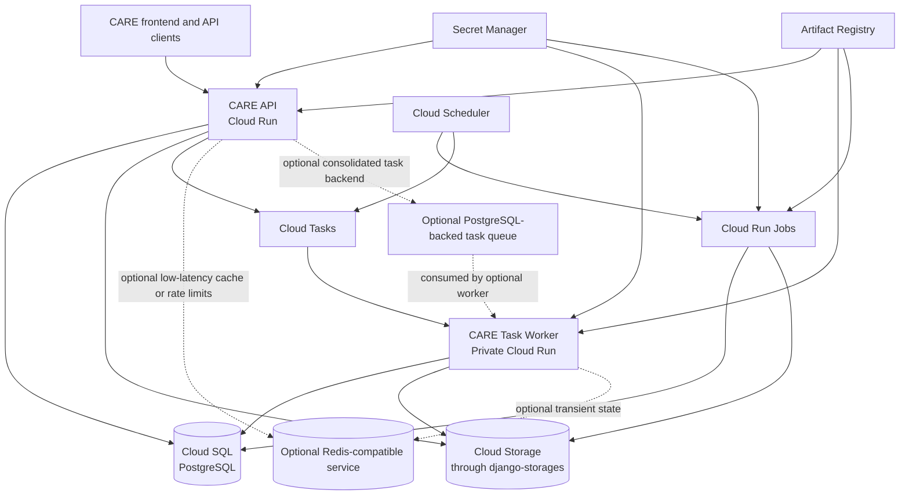

# Target GCP Runtime

## 1. Purpose

This document defines the target production runtime for CARE on Google Cloud
Platform.

It is based on the current runtime described in:

```text
docs/xii/architecture/01-current-runtime.md
```

The objective is to run CARE without a permanently active virtual machine,
minimize idle infrastructure cost where practical, reuse PostgreSQL for
appropriate responsibilities, and preserve compatibility with the official
upstream repository.

This document defines the desired end state.

The detailed implementation sequence is documented in:

```text
docs/xii/architecture/03-migration-plan.md
```

---

## 2. Primary Objective

The target runtime SHALL replace the current continuously running
Docker-Compose-style production topology with managed and request-driven GCP
services.

The default GCP architecture SHALL use:

- Cloud Run for the CARE HTTP API;
- Cloud SQL for PostgreSQL;
- Cloud Storage for uploaded and generated files;
- Django Storage API through `django-storages`;
- Cloud Tasks for request-triggered asynchronous work;
- a private Cloud Run service for task execution;
- Cloud Scheduler for periodic triggers;
- Cloud Run Jobs for migrations, maintenance and batch workloads;
- Secret Manager for secrets;
- Artifact Registry for container images;
- Cloud Logging for container logs.

PostgreSQL SHALL also be available as an optional shared backend for:

- Django cache;
- task execution state;
- report progress;
- idempotency;
- rate limiting;
- transient shared state;
- distributed coordination;
- PostgreSQL-backed task queues in deployment profiles where their operational
  trade-offs are acceptable.

Redis-compatible storage SHALL remain optional for responsibilities that
benefit from lower-latency shared state.

The target architecture SHALL NOT require:

- a Compute Engine VM;
- self-managed PostgreSQL;
- self-managed MinIO;
- a permanently running Celery worker in the default GCP profile;
- a permanently running Celery Beat process;
- Redis as a mandatory production dependency;
- direct browser-to-bucket uploads;
- direct application use of `boto3` for CARE file storage.

---

## 3. Design Principle: One Required Stateful Service

PostgreSQL is already required as CARE's durable database.

The architecture SHOULD reuse PostgreSQL for additional responsibilities when:

- the workload is moderate;
- the responsibility benefits from shared state;
- the additional database load is acceptable;
- avoiding another managed service materially reduces cost or complexity;
- PostgreSQL provides suitable correctness and concurrency semantics.

The system SHALL not introduce Redis merely because Redis is traditionally used
for a particular responsibility.

Likewise, PostgreSQL SHALL not be used for every responsibility merely because
it is already available.

Backend selection SHALL consider:

- correctness;
- latency;
- throughput;
- contention;
- operational cost;
- connection usage;
- maintenance burden;
- scale-to-zero behavior.

---

## 4. Target Architecture



The PostgreSQL-backed task queue shown in the diagram is optional.

It is not part of the default scale-to-zero GCP profile.

---

## 5. Supported Deployment Profiles

The target architecture SHALL support multiple coherent profiles rather than a
single mandatory combination of services.

### 5.1 Serverless GCP profile

The recommended default profile is:

```text
task backend: Cloud Tasks
cache backend: PostgreSQL or LocMem
rate-limit backend: PostgreSQL
transient-state backend: PostgreSQL
storage backend: Google Cloud Storage
scheduled work: Cloud Scheduler and Cloud Run Jobs
```

Properties:

- no Redis required;
- API can scale to zero;
- task worker can scale to zero;
- no continuously polling queue worker;
- PostgreSQL remains the main permanent cost.

### 5.2 PostgreSQL-consolidated profile

An optional consolidated profile MAY use:

```text
task backend: PostgreSQL-backed queue
cache backend: PostgreSQL
rate-limit backend: PostgreSQL
transient-state backend: PostgreSQL
storage backend: Google Cloud Storage or S3-compatible storage
```

Properties:

- no Redis required;
- no Cloud Tasks required;
- fewer infrastructure products;
- task queue and cache increase PostgreSQL load;
- a queue worker must remain available or be invoked periodically;
- immediate tasks may require a continuously running worker;
- it does not provide the same scale-to-zero behavior as Cloud Tasks.

This profile is primarily appropriate for:

- traditional container deployments;
- on-premise deployments;
- low-volume deployments;
- environments prioritizing service consolidation;
- installations willing to keep a worker active;
- environments where Cloud Tasks is unavailable or undesirable.

### 5.3 Redis-optimized profile

An optional Redis-compatible profile MAY use:

```text
task backend: Cloud Tasks or Celery
cache backend: Redis
rate-limit backend: Redis
transient-state backend: Redis
storage backend: Google Cloud Storage or S3-compatible storage
```

Possible providers include:

- Upstash;
- Google Memorystore;
- Redis;
- Valkey;
- Dragonfly;
- other compatible services.

### 5.4 Traditional CARE profile

The traditional profile MAY continue to use:

```text
PostgreSQL
Redis
Celery
Celery Beat
MinIO or S3
```

This remains useful for local development and conventional server
deployments.

---

## 6. Runtime Components

The default GCP runtime contains:

```text
care-api
care-worker
care-jobs
```

All three SHOULD use the same container image.

They differ by:

- startup command;
- IAM policy;
- scaling settings;
- runtime purpose;
- exposed routes;
- resource allocation.

An optional PostgreSQL queue profile MAY additionally run:

```text
care-queue-worker
```

This process consumes tasks from PostgreSQL.

It MAY use the same image, but it has different lifecycle requirements from the
request-driven Cloud Tasks worker.

---

## 7. CARE API Service

The CARE API SHALL run as a Cloud Run service.

Its responsibilities include:

- serving REST API requests;
- authenticating users;
- enforcing CARE permissions;
- receiving file uploads;
- returning file downloads;
- reading and writing PostgreSQL data;
- dispatching asynchronous work;
- serving health and readiness endpoints;
- serving static assets through WhiteNoise.

The API service SHALL NOT:

- run Celery Beat;
- execute scheduled cleanup loops;
- run database migrations during every startup;
- expose object-storage credentials to the frontend;
- generate direct upload URLs for browsers;
- require Redis unless Redis-backed functionality is selected.

The API MAY enqueue work into:

- Cloud Tasks;
- Celery;
- a PostgreSQL-backed task queue;

according to `CARE_TASK_BACKEND`.

---

## 8. Cloud Run Scaling

The API SHOULD initially use:

```text
minimum instances: 0
```

unless operational requirements justify warm instances.

The API SHALL define a maximum instance count based on:

- expected traffic;
- Cloud SQL connection limits;
- cost controls;
- per-instance concurrency;
- memory requirements;
- storage streaming behavior.

The following values MUST be designed together:

```text
Cloud Run concurrency
maximum Cloud Run instances
Gunicorn worker count
Gunicorn thread count
database connection lifetime
Cloud SQL maximum connections
database-backed cache traffic
database-backed rate-limit traffic
database-backed queue traffic
```

Using PostgreSQL for additional responsibilities increases the importance of
conservative connection and query management.

---

## 9. HTTP Server

The GCP runtime SHALL use a production WSGI server.

The Django development server and `runserver_plus` SHALL NOT be used in
production.

The expected process is conceptually:

```bash
gunicorn config.wsgi:application \
    --bind "0.0.0.0:${PORT}" \
    --workers "${GUNICORN_WORKERS}" \
    --threads "${GUNICORN_THREADS}" \
    --timeout "${GUNICORN_TIMEOUT}"
```

The process MUST listen on the `PORT` environment variable supplied by Cloud
Run.

Exact values SHALL be determined through load testing and database connection
limits.

---

## 10. Cloud SQL

PostgreSQL SHALL remain the durable system of record.

Cloud SQL for PostgreSQL SHALL replace local or self-managed PostgreSQL in GCP
environments.

The application SHALL continue using Django ORM normally.

No repository abstraction or replacement persistence layer is required.

### 10.1 Core responsibilities

Cloud SQL SHALL store:

- CARE domain records;
- authentication and authorization data;
- audit data;
- durable task execution state;
- idempotency records;
- report-generation progress when PostgreSQL is selected;
- shared transient state when PostgreSQL is selected;
- rate-limit counters when PostgreSQL is selected;
- Django database-cache entries when PostgreSQL is selected;
- PostgreSQL-backed task queue records when that backend is selected.

### 10.2 Connectivity

The API, worker and jobs SHALL connect using the supported Cloud Run and Cloud
SQL integration mechanism.

Database credentials SHALL be injected through Secret Manager or equivalent
runtime configuration.

The database SHALL NOT be exposed through unrestricted public networking.

### 10.3 Connection management

The GCP settings SHALL explicitly configure:

```text
CONN_MAX_AGE
CONN_HEALTH_CHECKS
```

where supported by the installed Django version.

The design SHALL account for:

```text
service instances × processes × threads × database aliases
```

Database-backed caching and queuing SHALL not create uncontrolled independent
connection pools.

### 10.4 Workload isolation

The initial implementation MAY use the same Cloud SQL database for:

- CARE application data;
- cache tables;
- rate-limit tables;
- transient-state tables;
- task queue tables.

Production deployments SHOULD monitor contention and database growth.

High-volume deployments MAY isolate infrastructure tables using:

- a separate PostgreSQL schema;
- a separate database in the same Cloud SQL instance;
- a separate Cloud SQL instance when operationally justified.

### 10.5 Availability

Development environments MAY use a low-cost, non-HA configuration.

Production SHALL document:

- availability requirements;
- backups;
- point-in-time recovery;
- maintenance windows;
- deletion protection;
- restore procedures;
- retention periods.

Cloud SQL is expected to represent the principal permanent baseline cost.

---

## 11. Storage Architecture

**Django Storage API is the architecture.** It is the single application-level
abstraction for object persistence. Providers are implementation details behind
it, selected by configuration alone.

Stated explicitly, because these are four separate claims and only the third and
fourth concern GCP:

1. **Django Storage API is the architecture** — not S3, not GCS, not MinIO.
2. **MinIO through `storages.backends.s3.S3Storage` is the default local
   profile.** `CARE_STORAGE_BACKEND` defaults to `s3`, so a local checkout keeps
   working with no configuration change and no GCP value of any kind.
3. **Generic S3-compatible storage remains supported** — AWS S3, MinIO and other
   providers `django-storages` supports, as a first-class deployment profile
   rather than a legacy path.
4. **GCS is the initial GCP storage profile, not the only supported provider.**
   It is one implementation of the abstraction; adding another provider is a
   settings change, not an application change.

**Implemented in IS-01.** `config/storage.py` builds the aliases;
`config/settings/base.py` selects the backend.

All CARE file storage SHALL use Django's Storage API.

The implementation SHALL use:

```text
django-storages
```

The application SHALL NOT maintain independent manual clients for S3, MinIO or
GCS.

The application SHALL NOT use `boto3` directly for CARE file persistence after
migration.

The application SHALL NOT use `google-cloud-storage` directly outside the
storage backend implementation.

**Status: all three hold.** No provider client is constructed anywhere for object
persistence *or* transport, and nothing imports `google-cloud-storage` at all.

**Object transport is entirely mediated by CARE.** No application code generates
a storage-provider URL and no client receives one. Presigned upload and download
are removed, as are the unsigned bucket URLs that served facility cover images
and user avatars. Every bucket can be private. `care/utils/csp/` — the
provider-credential and endpoint resolver that existed for signed URLs — is
deleted.

One provider-specific reference remains, outside persistence and transport:
`care/emr/tasks/report_generation.py` imports `botocore`'s `ClientError` for
Celery retry configuration. It constructs no client and performs no storage
operation, but it will not fire under `gcs`. See
`inventory/unresolved-items.md` S2.

**This is a gap in the target runtime, not merely an inventory note.** Retry
configuration that names a provider exception type is provider-specific code by
another route: under `gcs` a transient upload failure raises
`google.api_core.exceptions.*`, no retry fires, and the report fails on its
first attempt with no signal that a retry policy was ever intended.

The target runtime SHALL therefore satisfy one of:

- the storage boundary raises a provider-neutral exception type that retry
  policies name, so a transient failure retries identically under either
  backend; **or**
- report generation is excluded from the set of components declared
  production-ready under `gcs`, and that exclusion is stated wherever readiness
  is claimed.

Until one holds, `gcs` SHALL NOT be described as production-ready for report
generation. Both options are outside IS-01's remit: ES-01 §31 forbids modifying
Celery, and the first option changes behaviour under `s3` as well.

See `inventory/storage-call-sites.md` §11 for the per-call-site record.

---

## 12. Storage Backends

The target runtime SHALL support provider selection through Django's
`STORAGES` setting.

Principal backends:

```text
storages.backends.s3.S3Storage
storages.backends.gcloud.GoogleCloudStorage
```

The S3 backend supports:

- AWS S3;
- MinIO;
- compatible S3 providers supported by `django-storages`.

The GCS backend supports:

- native Google Cloud Storage;
- Application Default Credentials;
- Cloud Run service-account identity.

---

## 13. Logical Storage Aliases

CARE SHALL use separate aliases for:

```text
patient
facility
report
staticfiles
```

They SHALL be retrieved through:

```python
from django.core.files.storage import storages
```

Example:

```python
patient_storage = storages["patient"]
facility_storage = storages["facility"]
report_storage = storages["report"]
```

The aliases SHALL remain stable regardless of provider.

---

## 14. GCP Storage Configuration

The GCP settings SHALL configure aliases similar to:

```python
STORAGES = {
    "patient": {
        "BACKEND": "storages.backends.gcloud.GoogleCloudStorage",
        "OPTIONS": {
            "bucket_name": env("CARE_PATIENT_STORAGE_BUCKET"),
            "project_id": env("GCP_PROJECT_ID"),
        },
    },
    "facility": {
        "BACKEND": "storages.backends.gcloud.GoogleCloudStorage",
        "OPTIONS": {
            "bucket_name": env("CARE_FACILITY_STORAGE_BUCKET"),
            "project_id": env("GCP_PROJECT_ID"),
        },
    },
    "report": {
        "BACKEND": "storages.backends.gcloud.GoogleCloudStorage",
        "OPTIONS": {
            "bucket_name": env("CARE_REPORT_STORAGE_BUCKET"),
            "project_id": env("GCP_PROJECT_ID"),
        },
    },
    "staticfiles": {
        "BACKEND": (
            "whitenoise.storage."
            "CompressedManifestStaticFilesStorage"
        ),
    },
}
```

The exact options SHALL follow the installed `django-storages` version.

Cloud Run SHALL use service-account credentials rather than committed JSON
keys.

---

## 15. Local Storage Configuration

Local development SHALL continue supporting MinIO through:

```text
storages.backends.s3.S3Storage
```

with a custom endpoint.

Equivalent aliases SHALL exist for patient, facility and report files.

Local contributors SHALL not require GCP credentials.

---

## 16. Upload Policy

All uploads SHALL pass through the CARE Django API.

The API SHALL:

1. authenticate and authorize the caller;
2. validate file metadata;
3. validate extension;
4. validate MIME type;
5. enforce size limits;
6. save through the selected Django storage alias;
7. persist or update the corresponding record;
8. return a CARE-level response.

The frontend SHALL NOT:

- request a signed upload URL;
- upload directly to Cloud Storage;
- upload directly to MinIO;
- upload directly to S3;
- receive storage credentials;
- select the provider.

---

## 17. Download Policy

Downloads SHALL pass through CARE.

The API SHALL:

1. authenticate the caller;
2. authorize access;
3. determine the storage alias and object name;
4. open the object through Django Storage API;
5. return a streaming response;
6. set safe content headers.

Direct provider URLs SHALL not be the normal download mechanism.

---

## 18. Streaming and Temporary Files

The application SHALL avoid loading complete files into memory when streaming
is possible.

Uploads SHALL use Django upload handlers.

The deployment SHALL define:

```text
DATA_UPLOAD_MAX_MEMORY_SIZE
FILE_UPLOAD_MAX_MEMORY_SIZE
```

and CARE-specific maximum file sizes.

Downloads SHALL use streaming responses.

Very large media workflows are outside the initial scope.

---

## 19. Storage Consistency

Database and object storage cannot share one atomic transaction.

CARE SHALL manage partial failures explicitly.

Cleanup mechanisms SHALL handle:

- orphaned objects;
- incomplete records;
- failed deletions;
- interrupted uploads.

---

## 20. Static Files

Static files SHALL remain served through WhiteNoise.

Static collection SHALL happen during image build:

```bash
python manage.py collectstatic --noinput
```

Cloud Storage SHALL not be required for static files.

---

## 21. Task Backend Architecture

CARE SHALL support configurable task backends.

The initial supported values SHOULD be:

```text
cloud_tasks
postgres
celery
```

Conceptually:

```text
CARE_TASK_BACKEND=cloud_tasks
CARE_TASK_BACKEND=postgres
CARE_TASK_BACKEND=celery
```

### 21.1 Cloud Tasks

Default for GCP serverless deployments.

### 21.2 PostgreSQL task queue

Optional for consolidated or traditional deployments.

It SHALL use a task queue intentionally designed around PostgreSQL.

It SHALL NOT use an obsolete or unsupported Celery database broker transport.

A suitable implementation MAY use a maintained PostgreSQL-backed task library
with:

- Django integration;
- row locking;
- retries;
- scheduled execution;
- concurrency control;
- task status;
- worker health checks.

### 21.3 Celery

Retained for local and traditional deployments.

---

## 22. Task Dispatch Contract

The task-dispatch API SHALL conceptually support:

```python
enqueue_task(
    task_name,
    payload,
    delay_seconds=None,
    task_id=None,
)
```

It SHALL return an external task identifier.

Payloads SHALL be JSON-serializable.

Tasks SHOULD receive opaque identifiers and load state from PostgreSQL.

The application SHALL NOT enqueue:

- model instances;
- open files;
- lazy querysets;
- credentials;
- provider clients;
- complete clinical records when identifiers suffice.

---

## 23. Cloud Tasks Backend

The Cloud Tasks implementation SHALL:

- enqueue HTTP-target tasks;
- target a private Cloud Run worker;
- use OIDC authentication;
- support delayed delivery;
- serialize JSON payloads;
- return the Cloud Tasks name;
- configure retries through infrastructure;
- avoid static credentials.

This is the preferred GCP backend when scale-to-zero behavior is important.

---

## 24. PostgreSQL Task Backend

The PostgreSQL backend MAY enqueue tasks into Cloud SQL.

It SHALL use PostgreSQL-native transactional and locking semantics.

Potential benefits include:

- no separate broker service;
- transactional task creation;
- durable task records;
- simpler local and on-premise operation;
- easier inspection through SQL;
- consolidation of backups and monitoring.

Trade-offs include:

- additional database load;
- table growth and cleanup requirements;
- lock contention;
- increased connection usage;
- competition with clinical workloads;
- need for an active queue consumer;
- reduced scale-to-zero behavior.

### 24.1 Worker lifecycle

A PostgreSQL-backed queue does not execute tasks by itself.

It requires a worker that:

- waits through polling or PostgreSQL notifications;
- claims available jobs;
- runs handlers;
- updates job status;
- retries failures.

For immediate execution, the worker generally must remain active.

Therefore, the PostgreSQL backend SHALL NOT be described as equivalent to Cloud
Tasks for serverless scale-to-zero operation.

### 24.2 GCP execution options

A PostgreSQL queue worker MAY run as:

- a Cloud Run service with at least one active instance;
- a traditional container worker;
- a Kubernetes worker;
- a VM or on-premise process;
- a periodically invoked Cloud Run Job for non-urgent batches.

The periodically invoked job model is only appropriate when queue latency is
allowed to match the invocation schedule.

### 24.3 Transactional enqueue

Where supported, enqueueing a task inside the same PostgreSQL transaction as a
domain update MAY ensure that:

- both the domain change and task creation commit;
- or neither commits.

This is a useful option for work coupled to database state.

It does not remove the need for idempotent task execution.

---

## 25. Celery Backend

Celery SHALL preserve existing local behavior.

Local deployments MAY continue using Redis as:

```text
broker
result backend
```

Celery Beat MAY continue locally.

The GCP default deployment SHALL not start Celery when another task backend is
selected.

---

## 26. Worker Services

### 26.1 Cloud Tasks worker

The default GCP worker SHALL be a private Cloud Run HTTP service.

It SHALL scale to zero.

It SHALL accept only authenticated task requests.

### 26.2 PostgreSQL queue worker

The optional PostgreSQL worker SHALL consume jobs from PostgreSQL.

It SHALL not need a public HTTP endpoint.

It MAY require a continuously active process.

### 26.3 Celery worker

The traditional worker SHALL continue consuming from its configured Celery
broker.

All worker types SHOULD invoke the same reusable task logic.

---

## 27. Task Handler Registration

Task handlers SHALL be explicitly registered.

The application SHALL NOT execute arbitrary Python paths supplied in a
payload.

Only server-defined names SHALL be executable.

---

## 28. Reusable Task Logic

Existing Celery tasks SHALL be refactored when necessary into:

```text
reusable function
thin Celery wrapper
thin Cloud Tasks handler
thin PostgreSQL queue wrapper
```

Business behavior SHALL not be duplicated per backend.

---

## 29. Task Result Handling

Task results that matter to CARE SHALL be persisted in:

- existing domain records;
- report-upload records;
- task execution records;
- PostgreSQL queue job records where selected;
- other explicit application state.

Cloud Tasks response bodies SHALL not be treated as a durable result backend.

Redis task results SHALL not be mandatory.

---

## 30. Task Idempotency

All task backends SHALL be treated as capable of retrying or redelivering work.

Idempotency SHALL use:

- database state;
- unique constraints;
- conditional updates;
- object existence;
- idempotency keys;
- task-execution tables where required.

Redis SHALL not be the sole guarantee of clinical consistency.

---

## 31. Task Classification

### Cloud Tasks

Appropriate for:

- request-triggered work;
- email delivery;
- bounded report generation;
- serverless GCP execution;
- work requiring prompt dispatch.

### PostgreSQL task queue

Appropriate for:

- low-to-moderate volume;
- consolidated infrastructure;
- transactional enqueue;
- traditional or always-on workers;
- deployments without a managed queue service.

### Cloud Scheduler and Cloud Run Jobs

Appropriate for:

- periodic cleanup;
- migrations;
- bulk processing;
- maintenance;
- delayed batch execution.

### Celery

Appropriate for:

- existing local behavior;
- traditional Redis/RabbitMQ deployments;
- compatibility with upstream.

---

## 32. Initial Task Mapping

The default GCP mapping is:

| Current task | Default GCP mechanism | Optional PostgreSQL mechanism |
|---|---|---|
| TOTP enabled email | Cloud Tasks | PostgreSQL queue |
| TOTP disabled email | Cloud Tasks | PostgreSQL queue |
| report generation | Cloud Tasks | PostgreSQL queue |
| expired token cleanup | Scheduler + Cloud Run Job | Scheduled PostgreSQL task or management command |
| incomplete upload cleanup | Scheduler + Cloud Run Job | Scheduled PostgreSQL task or management command |

The implementation SHALL validate duration, idempotency and call sites.

---

## 33. Cloud Scheduler

Cloud Scheduler SHALL replace Celery Beat in the default GCP profile.

Schedules SHALL be committed through Terraform or another deployment
configuration.

Cloud Scheduler MAY:

- invoke a Cloud Run Job;
- enqueue a Cloud Task;
- invoke a protected management endpoint when justified.

A PostgreSQL queue deployment MAY instead use its queue library's periodic-task
support, but only when it intentionally runs an active worker.

---

## 34. Cloud Run Jobs

Cloud Run Jobs SHALL execute:

```text
database migrations
permission synchronization
value-set synchronization
fixtures
bulk cleanup
scheduled maintenance
batch imports
```

The same CARE image SHOULD be reused.

Migrations SHALL not run during ordinary API startup.

---

## 35. Cache Backend Architecture

CARE SHALL support configurable Django cache backends.

The initial supported values SHOULD include:

```text
postgres
locmem
redis
dummy
```

Conceptual selection:

```text
CARE_CACHE_BACKEND=postgres
CARE_CACHE_BACKEND=locmem
CARE_CACHE_BACKEND=redis
CARE_CACHE_BACKEND=dummy
```

---

## 36. PostgreSQL Database Cache

PostgreSQL MAY be the default shared cache for the low-cost GCP profile.

It SHALL use Django's database cache backend:

```python
CACHES = {
    "default": {
        "BACKEND": "django.core.cache.backends.db.DatabaseCache",
        "LOCATION": "care_cache",
        "OPTIONS": {
            "MAX_ENTRIES": 10000,
            "CULL_FREQUENCY": 3,
        },
    },
}
```

The deployment SHALL create the cache table explicitly:

```bash
python manage.py createcachetable
```

### 36.1 Appropriate uses

Database cache is suitable for:

- shared cache values across Cloud Run instances;
- low-to-moderate cache traffic;
- report progress;
- regenerated configuration;
- rate-limit support where semantics are compatible;
- avoiding an additional Redis service.

### 36.2 Trade-offs

Database caching adds:

- database reads and writes;
- table bloat;
- expiration cleanup work;
- contention with application queries;
- persistent storage use;
- latency compared with in-memory cache.

It SHALL not be assumed to provide Redis-level latency or throughput.

### 36.3 Cache is not the source of truth

Values stored through Django's cache API SHALL remain disposable.

Durable application state SHALL use normal models, even when both are stored in
PostgreSQL.

---

## 37. LocMem Cache

LocMem MAY be used for:

- instance-local performance optimizations;
- Swagger schemas;
- regenerated data;
- non-shared values.

It SHALL be treated as:

- process-local;
- ephemeral;
- non-coordinated;
- unsuitable for globally consistent state.

---

## 38. Redis Cache

Redis MAY be used for:

- high-frequency shared cache;
- lower-latency counters;
- larger shared transient workloads;
- deployments where PostgreSQL cache load becomes excessive.

The implementation SHOULD use standard Redis-compatible URLs.

Upstash MAY be selected without application-specific Upstash coupling.

---

## 39. Cache Backend Selection Guidance

| Requirement | Recommended backend |
|---|---|
| no shared cache needed | LocMem |
| shared, moderate-volume cache with minimum services | PostgreSQL |
| high-frequency, low-latency shared cache | Redis-compatible |
| tests with caching disabled | Dummy |
| durable business state | normal PostgreSQL models, not cache |

The backend SHALL be selected through configuration, not provider conditionals
spread through application code.

---

## 40. Report Progress

Report progress SHALL use one of:

```text
PostgreSQL database cache
dedicated PostgreSQL model
Redis-compatible cache
```

The default low-cost profile MAY use the PostgreSQL database cache.

A dedicated model SHOULD be preferred when progress must be:

- durable;
- auditable;
- queryable after expiration;
- associated with task execution history.

Report progress SHALL remain status information, not an integrity lock.

---

## 41. Rate Limiting

Globally consistent rate limits SHALL use shared state.

Supported options include:

```text
PostgreSQL
Redis-compatible storage
```

LocMem SHALL not be used for global enforcement across Cloud Run instances.

PostgreSQL rate limiting MAY use:

- dedicated models;
- atomic updates;
- database constraints;
- short-lived counter rows.

Cloud Armor MAY complement application limits, but SHALL not replace
user-specific or workflow-specific policies.

---

## 42. Shared Transient State

Shared transient state MAY use:

```text
PostgreSQL models
Django DatabaseCache
Redis-compatible storage
```

Selection depends on whether state must be:

- durable;
- queryable;
- audited;
- high-frequency;
- automatically expired.

Transient values that affect clinical correctness SHOULD use explicit
PostgreSQL models rather than a disposable cache backend.

---

## 43. Distributed Coordination

PostgreSQL MAY support coordination through:

- row-level locks;
- `SELECT ... FOR UPDATE`;
- unique constraints;
- conditional updates;
- advisory locks;
- queue-library locking mechanisms.

Redis MAY support optional short-lived distributed locks.

Neither cache locks nor queue locks SHALL replace database constraints for
clinical integrity.

---

## 44. Default Redis-Free Profile

The recommended initial Redis-free profile SHOULD be:

```text
CARE_TASK_BACKEND=cloud_tasks
CARE_CACHE_BACKEND=postgres
CARE_RATE_LIMIT_BACKEND=postgres
CARE_TRANSIENT_STATE_BACKEND=postgres
```

LocMem MAY remain configured as a separate cache alias for local,
non-coordinated optimizations.

This profile requires no `REDIS_URL`.

---

## 45. Fully Consolidated PostgreSQL Profile

An optional profile MAY use:

```text
CARE_TASK_BACKEND=postgres
CARE_CACHE_BACKEND=postgres
CARE_RATE_LIMIT_BACKEND=postgres
CARE_TRANSIENT_STATE_BACKEND=postgres
```

This minimizes infrastructure products but requires:

- PostgreSQL queue tables;
- an active queue worker;
- monitoring of database pressure;
- cleanup of cache and queue records;
- explicit capacity planning.

It SHALL not be presented as a fully serverless profile.

---

## 46. Optional Redis Profile

A Redis-enabled profile MAY use:

```text
CARE_CACHE_BACKEND=redis
CARE_RATE_LIMIT_BACKEND=redis
CARE_TRANSIENT_STATE_BACKEND=redis
```

Connection variables SHOULD remain separate:

```text
REDIS_CACHE_URL
REDIS_RATE_LIMIT_URL
REDIS_TRANSIENT_STATE_URL
```

They MAY point to the same instance.

They SHALL not be required to do so.

---

## 47. Upstash Compatibility

Upstash MAY be used through the standard Redis protocol.

Configuration SHALL remain provider-neutral:

```text
CARE_CACHE_BACKEND=redis
REDIS_CACHE_URL=rediss://...
```

The application SHOULD NOT require:

```text
USE_UPSTASH=true
```

Sensitive values SHALL be minimized and reviewed before storage in an external
Redis-compatible service.

---

## 48. Health Checks

Mandatory GCP checks SHALL include:

```text
application process
PostgreSQL
```

Optional checks MAY include:

```text
selected cache backend
selected queue backend
required external dependencies
```

Health checks SHALL reflect configured backends.

Examples:

- Cloud Tasks profile: no Celery queue check;
- PostgreSQL queue profile: check queue schema and database connectivity;
- Redis profile: check Redis only when Redis functionality is required;
- database-cache profile: check PostgreSQL and cache table availability.

---

## 49. Logging

API, worker and jobs SHALL log to stdout and stderr.

Structured logs SHOULD include:

```text
severity
timestamp
service
revision
request ID
task ID
task backend
task name
duration
retry count
status
```

Logs SHALL not contain sensitive clinical payloads or credentials.

---

## 50. Sentry

Sentry MAY remain optional.

Integrations SHALL match selected backends.

Examples:

- Celery integration only when Celery is active;
- Redis integration only when Redis is active;
- Django integration for API and HTTP task worker;
- normal exception capture for PostgreSQL queue workers and jobs.

---

## 51. Secret Manager

Secret Manager SHALL store:

```text
DJANGO_SECRET_KEY
database credentials
email credentials
Sentry DSN
JWT or JWKS material
optional Redis URLs
external-service credentials
```

PostgreSQL cache and queue backends SHOULD reuse the normal database identity
where appropriate rather than introduce separate secrets unnecessarily.

---

## 52. Service Accounts and IAM

Separate service accounts SHOULD exist for:

```text
care-api
care-worker
care-jobs
care-tasks-invoker
care-deployer
```

A PostgreSQL queue worker MAY use the worker identity but does not require Cloud
Run invocation permissions unless it also exposes HTTP routes.

Buckets SHALL not be public.

Cloud Tasks worker invocation SHALL require IAM authentication.

---

## 53. Artifact Registry and Image

Artifact Registry SHALL store immutable images tagged with:

```text
Git commit SHA
release tag
```

The same image SHOULD support:

```text
API command
Cloud Tasks worker command
PostgreSQL queue worker command
Cloud Run Job commands
Celery worker command
```

The image SHALL not embed secrets or run migrations in its default entrypoint.

---

## 54. GCP Settings Module

The repository SHALL add:

```text
config/settings/gcp.py
```

It SHALL inherit from:

```python
from .deployment import *
```

It SHALL configure:

- Cloud Run behavior;
- Cloud SQL;
- Django storage aliases;
- task backend;
- cache backend;
- rate-limit backend;
- transient-state backend;
- health checks;
- logging;
- optional Redis;
- upload limits.

It SHALL not heavily rewrite `deployment.py`.

---

## 55. Environment Variables

Core variables SHOULD include:

```text
DJANGO_SETTINGS_MODULE=config.settings.deployment

GCP_PROJECT_ID
GCP_REGION

CARE_TASK_BACKEND=cloud_tasks|postgres|celery
CARE_CACHE_BACKEND=postgres|locmem|redis|dummy
CARE_RATE_LIMIT_BACKEND=postgres|redis
CARE_TRANSIENT_STATE_BACKEND=postgres|redis

CARE_PATIENT_STORAGE_BUCKET
CARE_FACILITY_STORAGE_BUCKET
CARE_REPORT_STORAGE_BUCKET
```

Cloud Tasks variables:

```text
GCP_TASKS_LOCATION
GCP_TASKS_QUEUE
GCP_WORKER_URL
GCP_TASKS_SERVICE_ACCOUNT
```

PostgreSQL queue variables MAY include:

```text
CARE_POSTGRES_QUEUE_SCHEMA
CARE_POSTGRES_QUEUE_NAMES
CARE_POSTGRES_WORKER_CONCURRENCY
CARE_POSTGRES_WORKER_POLL_INTERVAL
```

Optional Redis:

```text
REDIS_CACHE_URL
REDIS_RATE_LIMIT_URL
REDIS_TRANSIENT_STATE_URL
```

---

## 56. Frontend Impact

The frontend SHALL:

- upload files to CARE endpoints;
- download files from CARE endpoints;
- stop requesting direct-upload URLs;
- stop sending files directly to buckets;
- stop depending on storage-provider responses.

No frontend change is required merely because cache or task state moves between
PostgreSQL and Redis.

---

## 57. Local Development

Docker Compose SHALL continue providing:

```text
PostgreSQL
Redis
MinIO
Celery
Celery Beat
Django backend
```

The project SHOULD additionally support testing the consolidated PostgreSQL
profile locally.

Local tests SHOULD cover:

```text
Celery + Redis
Cloud Tasks dispatcher through mocks or emulator strategy
PostgreSQL cache
PostgreSQL task queue, when implemented
MinIO through django-storages
```

---

## 58. Cost Boundaries

### Can scale to zero

```text
CARE API
Cloud Tasks HTTP worker
Cloud Run Jobs
```

### May require an active process

```text
PostgreSQL task queue worker
Celery worker
Celery Beat
```

### Usage-based

```text
Cloud Tasks
Cloud Scheduler
Cloud Storage operations
Artifact Registry
Secret Manager
Cloud Logging
```

### Persistent baseline cost

```text
Cloud SQL
stored Cloud Storage data
optional managed Redis
```

Using PostgreSQL for cache and queues may reduce the number of services but may
require a larger Cloud SQL instance.

The deployment SHALL compare total cost rather than only counting services.

---

## 59. Security Requirements

The target runtime SHALL enforce:

- private buckets;
- no direct frontend credentials;
- authenticated task invocation;
- no static production service-account keys;
- controlled Cloud SQL access;
- minimal task payloads;
- no clinical data in logs;
- least-privilege IAM;
- encrypted transport;
- separate environment data.

PostgreSQL infrastructure tables SHALL follow the same database backup,
encryption and access controls as the rest of CARE.

---

## 60. Terraform Scope

Terraform SHALL manage:

- GCP APIs;
- Artifact Registry;
- service accounts;
- IAM;
- Cloud SQL;
- Cloud Storage;
- Secret Manager;
- Cloud Tasks;
- Cloud Scheduler;
- Cloud Run API;
- Cloud Run HTTP worker;
- Cloud Run Jobs;
- optional PostgreSQL queue worker service;
- monitoring;
- environment-specific configuration.

PostgreSQL cache and queue schemas SHALL be created through migrations,
management commands or the queue library's schema tooling rather than Terraform
SQL embedded in infrastructure code.

---

## 61. Deployment Pipeline

The pipeline SHALL:

1. run linting;
2. run tests;
3. build the image;
4. publish the image;
5. run migrations;
6. create or update cache and queue schemas;
7. deploy the selected worker type;
8. deploy the API;
9. update schedules;
10. run smoke tests;
11. record the revision.

The pipeline SHALL detect the selected task and cache backends.

---

## 62. Smoke Tests

Smoke tests SHALL verify:

```text
API health
database connectivity
selected cache backend
selected task backend
static files
authenticated API operation
storage write and read
worker execution
scheduled jobs
```

For PostgreSQL cache:

```text
set
get
delete
expiration
```

For PostgreSQL queue:

```text
enqueue
claim
execute
retry
complete
duplicate protection
```

---

## 63. Target Runtime Summary

```text
CARE remains Django.

Django ORM remains unchanged.

PostgreSQL moves to Cloud SQL.

PostgreSQL may also provide cache, rate limits, transient state,
task state and an optional task queue.

Django Storage API handles all files through django-storages.

All uploads and downloads pass through Django.

Cloud Tasks remains the default queue for serverless GCP operation.

A PostgreSQL-backed queue is available for consolidated deployments.

Celery remains available for local and traditional deployments.

Redis remains optional rather than mandatory.

Cloud Scheduler replaces Celery Beat in the default GCP profile.

Cloud Run Jobs handle migrations and batch work.

No Compute Engine VM is required by the default GCP profile.
```

---

## 64. Definition of Done

The target runtime is achieved when:

- CARE runs on Cloud Run;
- PostgreSQL runs on Cloud SQL;
- Django Storage API handles all file operations;
- direct-to-bucket frontend flows are removed;
- Cloud Tasks works as the default GCP task backend;
- PostgreSQL is supported as an optional task backend;
- PostgreSQL is supported as a Django cache backend;
- PostgreSQL can support rate limits and transient shared state;
- Redis is optional;
- Upstash or another Redis-compatible provider can be selected;
- health checks follow selected backends;
- local Compose continues working;
- Celery remains supported;
- no permanent VM is required for the default profile;
- documentation clearly distinguishes the serverless and consolidated profiles.

---

## 65. Next Document

The next document is:

```text
docs/xii/architecture/03-migration-plan.md
```

It will define how to implement:

- Django Storage migration;
- Cloud Run and Cloud SQL deployment;
- PostgreSQL cache;
- optional PostgreSQL queue;
- Cloud Tasks;
- optional Redis;
- backend selection;
- frontend file-flow migration;
- testing and rollback;

while keeping the fork deployable after every phase.

