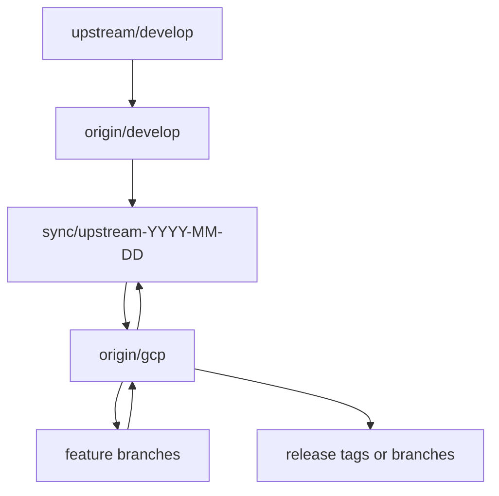

# Upstream Synchronization

## 1. Purpose

This document defines how the maintained GCP fork of CARE incorporates changes
from the official upstream repository.

The synchronization process SHALL preserve:

- a clean upstream mirror;
- a deployable GCP integration branch;
- traceable conflict resolution;
- reproducible tests;
- minimal divergence;
- the ability to identify which changes belong to upstream and which belong to
  the GCP adaptation.

This document assumes the official upstream development branch is:

```text
ohcnetwork/care:develop
```

The fork's maintained GCP branch is:

```text
origin/gcp
```

---

## 2. Core Rule

The fork SHALL maintain a branch that mirrors upstream without local product
changes.

The recommended branch is:

```text
origin/develop
```

This branch SHALL contain the same history and content as:

```text
upstream/develop
```

after each synchronization.

GCP-specific commits SHALL NOT be added directly to `origin/develop`.

---

## 3. Repository Remotes

A working clone SHALL define at least:

```text
origin
upstream
```

### 3.1 `origin`

`origin` points to the maintained fork.

Example:

```bash
git remote add origin git@github.com:YOUR-ORGANIZATION/care.git
```

### 3.2 `upstream`

`upstream` points to the official CARE repository.

```bash
git remote add upstream https://github.com/ohcnetwork/care.git
```

### 3.3 Verification

Run:

```bash
git remote -v
```

Expected conceptual output:

```text
origin    git@github.com:YOUR-ORGANIZATION/care.git
upstream  https://github.com/ohcnetwork/care.git
```

The exact transport MAY be SSH or HTTPS.

---

## 4. Branch Model

The recommended permanent branches are:

```text
develop
gcp
```

Temporary branches include:

```text
feature/*
fix/*
sync/upstream-YYYY-MM-DD
release/*
```

The conceptual flow is:



---

## 5. Branch Responsibilities

### 5.1 `develop`

Purpose:

```text
exact or near-exact mirror of upstream/develop
```

Rules:

- SHALL contain no GCP-specific commits;
- SHALL not contain local deployment patches;
- SHALL not contain environment secrets;
- SHALL not be used for production deployment;
- MAY be force-updated to match upstream;
- SHOULD be protected from normal pull-request merges.

### 5.2 `gcp`

Purpose:

```text
maintained integration of CARE and the GCP adaptation
```

Rules:

- SHALL contain all accepted GCP changes;
- SHOULD remain deployable;
- SHALL pass the supported test matrix;
- SHALL receive upstream changes through synchronization branches;
- SHOULD not be force-pushed after it becomes shared;
- SHOULD use pull requests for nontrivial changes.

### 5.3 `feature/*`

Purpose:

```text
isolated implementation work
```

Rules:

- SHOULD branch from `gcp`;
- SHOULD contain one coherent change;
- SHOULD be merged through pull request;
- SHALL run relevant tests;
- SHOULD be deleted after merge.

### 5.4 `sync/upstream-YYYY-MM-DD`

Purpose:

```text
merge and validate a specific upstream update
```

Rules:

- SHALL branch from the current `gcp`;
- SHALL merge the updated `develop`;
- SHALL contain conflict resolutions;
- SHALL contain only changes necessary for synchronization;
- SHALL pass local and GCP tests;
- SHALL be merged into `gcp` through pull request.

### 5.5 `release/*`

Optional purpose:

```text
stabilization before a production release
```

Release branches MAY be omitted if immutable tags on `gcp` are sufficient.

---

## 6. Initial Setup

For a new fork, configure the upstream mirror.

```bash
git remote add upstream https://github.com/ohcnetwork/care.git
git fetch upstream
```

Create or reset the local `develop` branch:

```bash
git switch -C develop upstream/develop
```

Push the mirror:

```bash
git push --force-with-lease origin develop
```

Create the initial GCP branch:

```bash
git switch -c gcp
git push -u origin gcp
```

After GCP-specific development begins, `gcp` SHALL not be reset to upstream.

---

## 7. Routine Upstream Synchronization

The recommended synchronization workflow is:

```bash
git fetch upstream
git fetch origin
```

Update the upstream mirror:

```bash
git switch develop
git reset --hard upstream/develop
git push --force-with-lease origin develop
```

Create a synchronization branch from the current GCP integration:

```bash
git switch gcp
git pull --ff-only origin gcp
git switch -c sync/upstream-YYYY-MM-DD
```

Merge the updated mirror:

```bash
git merge develop
```

Resolve conflicts, run tests and open a pull request into:

```text
gcp
```

---

## 8. Why Merge Instead of Rebase

The maintained `gcp` branch SHOULD normally incorporate upstream through merge.

Example:

```bash
git merge develop
```

Reasons:

- preserves the history of upstream synchronization events;
- avoids rewriting shared GCP history;
- makes conflict-resolution commits traceable;
- makes deployed revisions easier to audit;
- avoids forcing collaborators to repair rebased branches.

Rebase MAY be used on private feature branches before merge.

Rebase SHOULD NOT normally rewrite the shared `gcp` branch.

---

## 9. Mirror Update Safety

Updating `develop` uses:

```bash
git reset --hard upstream/develop
```

and:

```bash
git push --force-with-lease origin develop
```

This is acceptable only because `develop` is designated as an upstream mirror.

`git reset --hard` discards the **local** `develop` and its uncommitted changes.
The pre-flight checks SHALL therefore inspect the local branch, not `origin`:

```bash
git fetch upstream

# 1. Nothing uncommitted is about to be destroyed.
git status --porcelain   # SHALL be empty

# 2. No local-only commits are about to be destroyed.
git log --oneline upstream/develop..develop   # SHALL be empty
```

Checking `upstream/develop..origin/develop` is not sufficient: it describes what
the remote carries, while the reset acts on the local branch. A commit made
locally and never pushed is invisible to that comparison and would be lost.

If local commits exist, they SHALL be:

- moved to an appropriate feature branch;
- reviewed;
- removed from `develop`.

The process SHALL not silently discard valuable work.

After pushing, confirm the mirror is actually a mirror. `git log` in one
direction only proves the absence of extra commits, not equality of content:

```bash
git diff --exit-code upstream/develop develop
git diff --exit-code upstream/develop origin/develop
```

Both SHALL exit zero.

---

## 10. Synchronization Frequency

Upstream synchronization SHOULD occur:

- before beginning a major GCP feature;
- before a production release;
- after significant upstream security fixes;
- after upstream changes to storage, tasks, settings or deployment;
- regularly enough to prevent a very large divergence.

A practical cadence MAY be:

```text
monthly
before each release
immediately for relevant security updates
```

The exact cadence depends on upstream activity and deployment needs.

Frequent small synchronizations are preferred over rare large ones.

---

## 11. Pre-Merge Review

Before merging `develop` into a synchronization branch, inspect upstream
changes.

Useful commands:

```bash
git log --oneline gcp..develop
```

```bash
git diff --stat gcp...develop
```

```bash
git diff --name-status gcp...develop
```

Review changes affecting:

```text
config/settings/
config/celery_app.py
care/emr/tasks/
care/emr/utils/file_manager.py
file models and serializers
upload and download endpoints
Dockerfiles
Compose files
startup scripts
health checks
dependencies
plugins
migrations
authentication
permissions
```

The synchronization pull request SHOULD summarize relevant upstream changes.

---

## 12. Conflict Resolution Principles

Conflicts SHALL be resolved according to these priorities:

1. preserve upstream business behavior;
2. preserve security fixes;
3. preserve data-model and migration correctness;
4. preserve the GCP deployment contract;
5. minimize custom code;
6. move deployment-specific behavior into isolated files where possible.

The resolver SHALL not blindly select:

```text
ours
```

or:

```text
theirs
```

for entire files without understanding both sides.

---

## 13. Conflict Categories

Every conflict SHOULD be classified.

Recommended categories:

```text
settings
dependencies
storage
tasks
cache or Redis
Docker or runtime scripts
health checks
Terraform or CI
tests
documentation
unrelated application behavior
```

The synchronization pull request SHOULD identify:

- affected files;
- conflict category;
- resolution;
- behavior preserved;
- tests run.

---

## 14. Settings Conflicts

Settings files are likely conflict areas.

Preferred strategy:

- preserve upstream `base.py` changes;
- preserve upstream `deployment.py` changes;
- keep GCP-specific overrides in `config/settings/gcp.py`;
- avoid copying large blocks from upstream settings into `gcp.py`;
- import and override only what differs.

When upstream adds a new setting:

1. determine whether the GCP profile can inherit it;
2. override only if GCP behavior differs;
3. add a GCP-specific test when required.

Repeated settings conflicts indicate that too much GCP logic is located in
upstream-owned settings files.

---

## 15. Dependency Conflicts

When upstream changes dependency versions or lockfiles:

1. preserve upstream dependency changes;
2. reapply GCP-specific dependencies using the repository's package manager;
3. regenerate the lockfile;
4. run the complete dependency test suite;
5. verify supported Python and Django versions;
6. verify `django-storages`, Google clients and task clients remain compatible.

Do not manually combine lockfile sections without using the package manager.

GCP dependencies SHOULD remain as small as practical.

---

## 16. Storage Conflicts

Storage-related upstream changes require special review.

Inspect whether upstream has changed:

- file models;
- object naming;
- upload completion semantics;
- MIME validation;
- cleanup behavior;
- file permissions;
- signed URL APIs;
- `files_manager`;
- bucket configuration.

The GCP fork SHALL preserve the target storage policy:

```text
Django Storage API
django-storages
server-mediated uploads
server-mediated downloads
no direct browser bucket access
```

If upstream adopts Django Storage API, the fork SHOULD remove redundant custom
patches and move closer to upstream.

If upstream changes file behavior, the fork SHALL update storage and API tests
before merging.

---

## 17. Task Conflicts

Inspect upstream changes to:

- Celery task signatures;
- task names;
- retries;
- schedules;
- call sites;
- result usage;
- task modules;
- plugin tasks.

The GCP fork SHALL preserve:

```text
Cloud Tasks as default GCP backend
Celery compatibility locally
reusable task logic
explicit handler registration
```

When upstream adds a new Celery task:

1. keep it working under Celery;
2. classify it;
3. decide whether GCP uses Cloud Tasks, Cloud Run Jobs or synchronous execution;
4. add it to the task inventory;
5. add tests before enabling it in production.

Upstream task names SHOULD remain stable where possible.

---

## 18. Cache and Redis Conflicts

When upstream adds new default-cache or Redis use:

1. identify the responsibility;
2. determine whether it requires shared state;
3. determine whether PostgreSQL is sufficient;
4. determine whether Redis remains optional;
5. add backend-specific tests;
6. avoid making `REDIS_URL` mandatory in GCP unintentionally.

New upstream Redis usage SHALL be classified as:

```text
cache
rate limiting
progress
lock
temporary state
session
Celery
direct Redis use
unknown
```

Unknown use SHALL not be merged into production without investigation.

---

## 19. Docker and Startup Conflicts

Upstream may change:

- development Dockerfile;
- production Dockerfile;
- Compose services;
- startup scripts;
- migration behavior;
- Celery startup;
- health checks.

The GCP fork SHOULD preserve upstream local development behavior.

GCP runtime behavior SHOULD remain isolated in:

```text
docker/gcp.Dockerfile
scripts/start-gcp-api.sh
scripts/start-gcp-task-worker.sh
scripts/run-gcp-job.sh
config/settings/gcp.py
deploy/gcp/
```

If upstream provides a production container suitable for Cloud Run, the fork
SHOULD evaluate reusing it rather than maintaining a duplicate image.

---

## 20. Database Migration Conflicts

Upstream migrations SHALL generally be accepted unchanged.

The GCP fork SHALL NOT edit upstream migration files after release merely to
resolve conflicts.

After synchronization, test from an empty database:

```bash
python manage.py migrate --noinput
```

Because production is greenfield initially, clean-schema migration is a primary
test.

After real production use begins, also test upgrades from the currently
deployed schema.

Migration conflicts involving plugins SHALL be resolved according to plugin
ownership and documented dependencies.

---

## 21. Test Conflicts

Upstream tests SHALL be preserved.

When upstream changes expected behavior, GCP-specific tests SHALL be reviewed
for assumptions that are no longer valid.

The fork SHALL not weaken upstream assertions merely to make GCP patches pass.

If a GCP-specific test conflicts with an upstream behavior change, determine
whether:

- the upstream change should be inherited;
- the GCP implementation should adapt;
- the GCP deployment policy intentionally differs;
- an ADR is required.

---

## 22. Documentation Conflicts

GCP documentation MAY refer to paths, task names, settings or commands that
upstream changes.

After synchronization, search documentation for outdated references.

Examples:

```bash
grep -R "S3FilesManager" docs/xii
grep -R "CELERY_BROKER_URL" docs/xii
grep -R "config.settings.deployment" docs/xii
```

Documentation changes SHALL be included in the synchronization pull request
when implementation changes affect them.

---

## 23. Required Test Sequence

After conflict resolution, run the local upstream-compatible tests first.

```bash
make build
make up
make load-fixtures
make test
```

Then run GCP-specific tests.

Required conceptual groups:

```text
GCP settings
production image build
Cloud SQL migration from empty schema
Django storage aliases
MinIO integration
GCS integration
file upload API
file download API
task dispatch
Cloud Tasks worker
PostgreSQL cache
Redis-free startup
optional Redis profile
Cloud Run Jobs
Terraform validation
```

The exact commands SHALL be documented in `04-testing.md` and project scripts.

---

## 24. Synchronization Pull Request Template

A synchronization pull request SHOULD include:

```markdown
## Upstream range

Previous upstream commit:
`<sha>`

New upstream commit:
`<sha>`

## Relevant upstream changes

- ...
- ...

## Conflicts resolved

| File | Category | Resolution |
|---|---|---|
| ... | ... | ... |

## GCP adaptations updated

- ...
- ...

## Tests

- [ ] Local build
- [ ] Local test suite
- [ ] GCP settings
- [ ] Storage integration
- [ ] Task tests
- [ ] PostgreSQL cache
- [ ] Container build
- [ ] Terraform validation
- [ ] Staging smoke tests

## Known follow-up

- ...
```

---

## 25. Synchronization Commit Style

A synchronization branch MAY contain:

1. the upstream merge commit;
2. focused conflict-resolution commits;
3. test or documentation fixes required by upstream changes.

Recommended commit examples:

```text
merge: sync upstream develop 2026-08-05
fix(storage): adapt file API to upstream upload model changes
fix(tasks): register new upstream notification task
test(gcp): update storage regression cases
docs(gcp): update settings references after upstream sync
```

Avoid mixing unrelated new GCP features into the synchronization branch.

---

## 26. Release References

Each production release SHOULD record:

- GCP integration commit SHA;
- upstream base commit SHA;
- container image digest;
- Terraform commit SHA;
- database migration state;
- deployment timestamp.

A release tag MAY use:

```text
gcp-vYYYY.MM.DD.N
```

or semantic versioning.

The tag message SHOULD include:

```text
Upstream base: <sha>
GCP commit: <sha>
Image digest: <digest>
```

---

## 27. Tracking the Upstream Base

The repository SHOULD make the upstream base easy to identify.

Possible mechanisms:

- merge history;
- release notes;
- a text file such as `UPSTREAM_BASE`;
- build metadata;
- deployment annotations.

Example file:

```text
UPSTREAM_BASE
```

Contents:

```text
repository=https://github.com/ohcnetwork/care
branch=develop
commit=<sha>
synchronized_at=<ISO-8601 timestamp>
```

If this file is used, it SHALL be updated only during upstream synchronization.

---

## 28. Recurring Conflict Register

The project SHOULD maintain:

```text
docs/xii/architecture/upstream-conflicts.md
```

For each recurring conflict, record:

```text
file
reason
frequency
current workaround
preferred structural improvement
upstream PR possibility
```

Example:

```markdown
## config/settings/base.py

Reason:
GCP cache selection currently modifies the shared cache block.

Preferred improvement:
Move all GCP cache overrides into `config/settings/gcp.py`.

Status:
Open.
```

The register helps reduce future maintenance cost.

---

## 29. Reducing Divergence

When a conflict recurs, prefer these remedies in order:

1. move GCP behavior into `config/settings/gcp.py`;
2. add a new GCP-specific script;
3. add a helper module;
4. use an existing upstream extension point;
5. propose a small provider-neutral upstream improvement;
6. maintain a focused patch only when necessary.

The project SHALL not respond to recurring conflicts by copying entire upstream
modules into GCP-specific versions unless there is no reasonable alternative.

---

## 30. Upstream Contributions

Some GCP work may be suitable for upstream contribution.

Potential upstream-friendly improvements include:

- using Django Storage API;
- reducing direct `boto3` coupling;
- extracting reusable task logic;
- making Redis health checks conditional;
- avoiding unconditional Redis startup dependencies;
- using management commands for periodic cleanup;
- improving backend configuration validation.

An upstream pull request SHOULD:

- remain provider-neutral;
- preserve existing behavior;
- avoid GCP-specific names;
- include tests;
- be small enough to review independently.

GCP-specific Terraform, IAM and Cloud Run definitions generally remain in the
fork unless upstream requests them.

---

## 31. Security Update Process

Relevant upstream security changes SHALL be prioritized.

When upstream publishes or merges a security fix:

1. inspect the affected code;
2. determine whether the GCP fork modifies the same area;
3. create an expedited synchronization branch;
4. resolve conflicts carefully;
5. run focused security tests;
6. deploy an immutable release;
7. record the upstream base.

Security fixes SHALL not wait for the normal synchronization cadence when they
affect deployed functionality.

---

## 32. Failed Synchronization

If a synchronization cannot be completed safely:

- do not merge partially resolved code into `gcp`;
- document the blocking upstream change;
- keep the current production revision;
- create focused investigation branches;
- identify whether a GCP customization must be redesigned;
- avoid making unsupported claims of compatibility.

The synchronization pull request MAY remain draft until tests pass.

---

## 33. Reverting a Synchronization

If a merged synchronization causes application regressions, prefer reverting
the synchronization merge or deploying the previous immutable release.

Example:

```bash
git revert -m 1 <merge-commit-sha>
```

The correct parent number SHALL be verified before executing the revert.

Do not reset shared `gcp` history after deployment.

A Git revert does not automatically reverse database migrations.

Database compatibility SHALL be evaluated separately.

---

## 34. First Greenfield Release

Before the first real production use, upstream synchronization is simpler
because there is no production data to preserve.

The project MAY:

- recreate development and staging environments;
- rerun all migrations from an empty schema;
- rebuild empty buckets;
- replace experimental infrastructure.

The first production release SHALL still record:

- exact upstream commit;
- exact GCP commit;
- image digest;
- Terraform state;
- test results.

---

## 35. Synchronization After Real Use Begins

After real patient or operational data exists, synchronization SHALL include:

- database upgrade testing;
- backwards-compatible migration review;
- production backup verification;
- storage API regression testing;
- application rollback compatibility;
- scheduled-job review;
- task idempotency review.

The project SHALL no longer treat production resources as disposable.

---

## 36. Automated Upstream Monitoring

The project MAY automate detection of new upstream commits.

Possible mechanisms:

- scheduled GitHub Action;
- repository comparison workflow;
- dependency update bot;
- release-monitoring task.

Automation MAY open an issue or draft pull request.

It SHALL not automatically merge upstream changes into `gcp` without tests and
review.

---

## 37. Suggested Automation Workflow

A scheduled workflow MAY:

1. fetch upstream;
2. compare `origin/develop` with `upstream/develop`;
3. report new commits;
4. list changed files;
5. flag high-risk paths;
6. open an issue or draft synchronization pull request.

High-risk paths include:

```text
config/settings/
care/emr/tasks/
care/emr/utils/
file models
upload endpoints
download endpoints
Dockerfiles
scripts/
migrations/
requirements or lockfiles
```

---

## 38. Synchronization Checklist

Before opening a synchronization pull request:

- [ ] Fetch `origin` and `upstream`.
- [ ] Verify local worktree is clean.
- [ ] Reset `develop` to `upstream/develop`.
- [ ] Push `origin/develop` with `--force-with-lease`.
- [ ] Create a dated synchronization branch from `gcp`.
- [ ] Review upstream commit range.
- [ ] Merge `develop`.
- [ ] Classify every conflict.
- [ ] Resolve conflicts without discarding security or domain changes.
- [ ] Update GCP settings and documentation where required.
- [ ] Run local tests.
- [ ] Run GCP tests.
- [ ] Build the production image.
- [ ] Validate Terraform.
- [ ] Run staging smoke tests for high-risk updates.
- [ ] Record the new upstream base.

---

## 39. Merge Checklist

Before merging into `gcp`:

- [ ] Pull request review complete.
- [ ] No unresolved conflict markers.
- [ ] No accidental secrets.
- [ ] Local profile passes.
- [ ] Redis-free GCP profile passes.
- [ ] Storage tests pass.
- [ ] Task tests pass.
- [ ] PostgreSQL cache tests pass.
- [ ] Optional Redis tests pass when relevant.
- [ ] Empty-database migrations pass.
- [ ] Documentation references are current.
- [ ] Upstream base metadata is updated.
- [ ] Deployment risk is understood.

---

## 40. Definition of Successful Synchronization

An upstream synchronization is complete when:

- `origin/develop` matches `upstream/develop`;
- the new upstream code is merged into `gcp`;
- conflicts are documented;
- local CARE behavior passes tests;
- the GCP runtime passes tests;
- a production image builds;
- Terraform validates;
- the upstream base is recorded;
- no known security or data-model regression remains;
- the `gcp` branch is deployable.

---

## 41. Next Document

The next document is:

```text
docs/xii/architecture/06-operations.md
```

It will define:

- initial environment creation;
- deployment;
- database initialization;
- secret management;
- Cloud Run service operation;
- Cloud Run Jobs;
- Cloud Scheduler;
- task and queue operations;
- storage operations;
- PostgreSQL cache maintenance;
- optional Redis operation;
- backups;
- recovery;
- monitoring;
- cost controls;
- routine maintenance.
